# 系統流程圖與架構圖

> 版本：2026-10-10 晚（依 10-10 定案的六份設計規格更新，**圖號從頭重排**、新增圖 7 與圖 13、ERD 拆成三張；前一版 2026-10-08 依 10-07 錄音討論更新角色與主線）
> 每張圖的原始碼存放在 `docs/images/` 的 `.mmd` 檔，本文件內容與 `.mmd` 檔一致；PNG／SVG 由 Mermaid CLI 匯出，正式規格書引用 PNG。
> 流程以正式規格書為準；登入導頁與資料表以目前程式（`app/routes/main.py`、`app/models/`）為準，尚未實作的部分在圖中標示「待新增」或以虛線框表示。

## 圖表閱讀方式

| 顏色 | 代表 |
| --- | --- |
| 淺藍 | 學生 |
| 淺綠 | 導師 |
| 淺紫 | 系統管理者（開發者）、科主任或科助 |
| 淺灰藍 | 系統自動處理 |
| 淺橘 | AI 輔助（選用，失敗時可人工處理） |
| 淺紅 | 錯誤或缺件提示 |
| 虛線框 | 待確認、後續擴充或補充說明 |

## 圖表清單

2026-10-10 圖號從頭重排（舊圖 7「專題共同審查」已移除）。

| 規格書圖號 | 圖表 | 原始碼與圖檔 | 舊圖號 |
| --- | --- | --- | --- |
| 圖 1～4 | 使用案例圖：學生、老師、科辦、系統管理者 | `images/D-01-use-case-by-role.py` 產生 `D-01-use-case-student`／`teacher`／`staff`／`admin` 的 `.png`／`.svg` | 圖 1、2、1-1、3 |
| 參考 | 使用者案例總覽（所有角色合併） | `images/D-01-use-case-v2.mmd`／`.png`／`.svg` | — |
| 圖 5 | 登入與角色導頁流程圖 | `images/D-02-login-role-routing.*` | 圖 4 |
| 圖 6 | 學生主線流程圖 | `images/D-10-main-line-flow.*` | 圖 5 |
| 圖 7 | 學校資料匯入流程圖（新增） | `images/D-21-school-data-import-flow.*` | — |
| 圖 8 | 導師確認流程圖 | `images/D-16-teacher-confirm-flow.*` | 圖 9 |
| 圖 9 | 科辦核准電子獎狀流程圖 | `images/D-18-staff-service-record-flow.*` | 圖 16 |
| 圖 10 | 科辦表單下載區流程圖 | `images/D-20-form-download-flow.*` | 圖 6 |
| 圖 11 | 招生資料更新流程圖 | `images/D-13-admission-rule-update-flow.*` | 圖 8 |
| 圖 12 | 二技招生公告與 AI 推薦校系流程圖 | `images/D-19-admission-announcement-flow.*` | 圖 17 |
| 圖 13 | 官網資料來源、資料分類與來源維護流程圖（新增） | `images/D-22-info-source-classify-flow.*` | — |
| 圖 14 | 系統管理者維護校系備審要求流程圖 | `images/D-17-admin-maintain-requirements.*` | 圖 10 |
| 圖 15 | 角色與責任圖 | `images/D-14-role-responsibility.*` | 圖 11 |
| 圖 16 | 系統架構圖 | `images/D-05-system-architecture.*` | 圖 12 |
| 圖 17 | DFD 資料流程圖 | `images/D-06-dfd.*` | 圖 13 |
| 圖 18-1～18-3 | ERD（依功能拆成三張；另有全部資料表總覽當參考） | `images/D-09-erd-part1-learning`、`part2-review`、`part3-sources`、`D-09-erd-v2`（由 `D-09-erd-build.py` 產生） | 圖 14 |
| 圖 19 | 報告用總體流程圖 | `images/D-15-report-overview.*` | 圖 15 |
| 圖 20 | 功能架構圖（系統→角色→功能） | `images/D-23-function-architecture.mmd`；待環境可用時輸出 PNG／SVG | — |
| 圖 21 | 2026 開發甘特圖 | `images/D-24-gantt-2026.mmd`；待環境可用時輸出 PNG／SVG | — |
| 圖 22 | 登入與角色導頁細部流程 | `images/D-25-login-flow.mmd`；待環境可用時輸出 PNG／SVG | — |
| 圖 23 | 學生資料上傳、擷取與本人確認流程 | `images/D-26-student-upload-flow.mmd`；待環境可用時輸出 PNG／SVG | — |
| 圖 24 | 二技目標校系推薦流程 | `images/D-27-target-recommendation-flow.mmd`；待環境可用時輸出 PNG／SVG | — |
| 圖 25 | 備審送審與導師確認流程 | `images/D-28-review-package-flow.mmd`；待環境可用時輸出 PNG／SVG | — |
| 圖 26 | 電子獎狀、TA 與社團證明流程 | `images/D-29-certificate-flow.mmd`；待環境可用時輸出 PNG／SVG | — |
| 圖 27 | 管理員資料來源維護流程 | `images/D-30-admin-source-flow.mmd`；待環境可用時輸出 PNG／SVG | — |

## 圖 1～4：依角色的使用案例圖

規格書的圖 1～4 依角色分開畫（人形＋功能橢圓），樣式參考歷屆專題報告書。這三張不是 Mermaid 圖，而是由 `images/D-01-use-case-by-role.py` 產生：

| 規格書圖號 | 角色 | 圖檔 |
| --- | --- | --- |
| 圖 1 | 學生 | `images/D-01-use-case-student.png`／`.svg` |
| 圖 2 | 老師（導師、專任教師、指導老師） | `images/D-01-use-case-teacher.png`／`.svg` |
| 圖 3 | 科辦／科助 | `images/D-01-use-case-staff.png`／`.svg` |
| 圖 4 | 系統管理者（開發者） | `images/D-01-use-case-admin.png`／`.svg` |

修改方式：打開 `D-01-use-case-by-role.py`，修改最上方 `ROLES` 裡的功能清單，再到 `docs/images` 資料夾執行 `python D-01-use-case-by-role.py`，四張圖（含科辦）會一起更新。

### 2026-10-08 錄音討論後的流程圖基準

依 [10-07 會議紀錄](../06_會議錄音與逐字稿/AI_會議紀錄_科助使用者端與小助手_2026-10-07.md) 與 10-08 使用者決定：

| 項目 | 決定 |
| --- | --- |
| 選校系 | AI Agent 依學生條件推薦，學生自己選，可選多個 |
| 上傳後 | AI 辨識並判斷格式；辨識失敗時說明可能原因與修正方式；確認前 AI 標出可疑處，一定要學生本人確認 |
| 成績單、證照、競賽證明 | 不經導師審核。證照由 AI 初判真偽；競賽證明由主辦方（例如 AREC）開立、學生自行上傳，AI 只整理欄位並標出可疑處，不判斷真偽；每筆資料標示證明來源 |
| 教師端 | 導師、專任教師、指導老師共用 `teacher` 角色，以與學生的關係決定範圍 |
| 學校紀錄 | 獎懲記錄（學校統整的正式紀錄）與電子證書，和成績單一樣由學生下載後上傳；AI 逐列讀出並分類，讀出電子證書驗證碼 |
| 科辦／科助 | 替科上派的服務核准電子獎狀：學生從獎懲記錄勾選並申請 → 科辦對照、編輯內文後核准 → 系統產出含驗證碼的獎狀（固定外框、內文可編輯）；**不審備審資料** |
| 自傳與備審 | AI 可引用學生資料（含獎懲記錄、電子證書、電子獎狀）撰寫，標示依據 |
| 備審資料 | 只由導師確認 |

待確認（不畫進主線）：電子獎狀可否放學校 logo；科辦核准時需要學生附什麼佐證；系統可否自動到學校網站查驗驗證碼；科辦是否在系統開放競賽報名、處理公假與嘉獎申請（後續擴充，性質同行政表單）。

### 2026-10-10 定案後的流程圖基準

依 `docs/02_需求與設計/` 的四份 10-10 設計規格（導師確認版本與段落註解、資管科小助手 10.7、二技公告與 AI 推薦校系、引導卡片與科辦管理員功能清單）：

| 項目 | 決定 | 影響的圖 |
| --- | --- | --- |
| 選校系 | 一～四年級不限數量、隨時可換；五年級做備審時最多 5 所；AI 推薦＝規則算符合程度＋AI 寫理由 | 圖 1、圖 5、圖 17 |
| 上傳後 | AI 在學生確認畫面旁註記可能的問題與修改建議，學生本人確認（照 10-07 指導老師錄音） | 圖 1、圖 5、圖 11、圖 13、圖 15 |
| 導師確認 | 只能確認送審的那一版；確認畫面同時顯示送審版與最新版；老師（導師、專任、指導老師）可加段落註解，學生可回覆 | 圖 2、圖 5、圖 9、圖 13、圖 14 |
| 二技公告 | AI 代理查資管相關科系、只存文字（每個來源只留最新一份簡章檔）；管理員核對後公告給學生、老師（四、五年級學生）、科辦 | 圖 3、圖 8、圖 12、圖 13、圖 14、圖 17 |
| 科辦 | 電子獎狀加 TA 證明、社團證明；拿掉「登錄送件審查結果」；批次上傳公假、嘉獎不做；表單下載區要有完整流程圖（使用者：功能簡單也要畫） | 圖 1-1、圖 6、圖 11、圖 16 |
| 移除的圖 | 圖 6 舊版（行政表單數位化與收件）、圖 7（專題共同審查）和定案衝突，搬到封存 | 圖 6、圖 7 |
| 管理員 | 新增二技公告核對發布、操作紀錄查詢；專題類型與需求模板先隱藏 | 圖 3、圖 11 |

### 2026-10-10 晚：再補上的定案（學校資料匯入、官網資料來源、帳號）

上表「影響的圖」是重排前的舊圖號；下表用新圖號。

| 項目 | 決定 | 影響的圖（新圖號） |
| --- | --- | --- |
| 學校資料匯入 | 成績、獎懲、缺曠可整段貼上；缺曠只存合計、只有學生與班導看得到、不送 AI | 圖 1、2、6、7、15、16、17、18-1、19 |
| 官網資料與分類 | 資管科官網、資圖中心、教務處行事曆照二技公告機制；系統內重新分類；資料來源維護 | 圖 4、13、15、16、17、18-3 |
| 畢業學分檢查 | 依入學年度的修業科目表 | 圖 1、7、17、18-1 |
| 表單下載區 | 科辦管理、學生與老師下載 | 圖 1、2、3、15、16、17、18-3 |
| 帳號 | 沒有個人資料頁；使用者不能自己改密碼，只有管理員能改（例如學生換了身分證字號）；管理員可停用帳號 | 圖 1～4 |
| 微學分 | 學校沒有微學分系統，要寫紙本向教務處申請；放進系統的方式待確認 | 圖 6 |

## 參考：使用者案例總覽（所有角色合併；規格書改用圖 1～4）

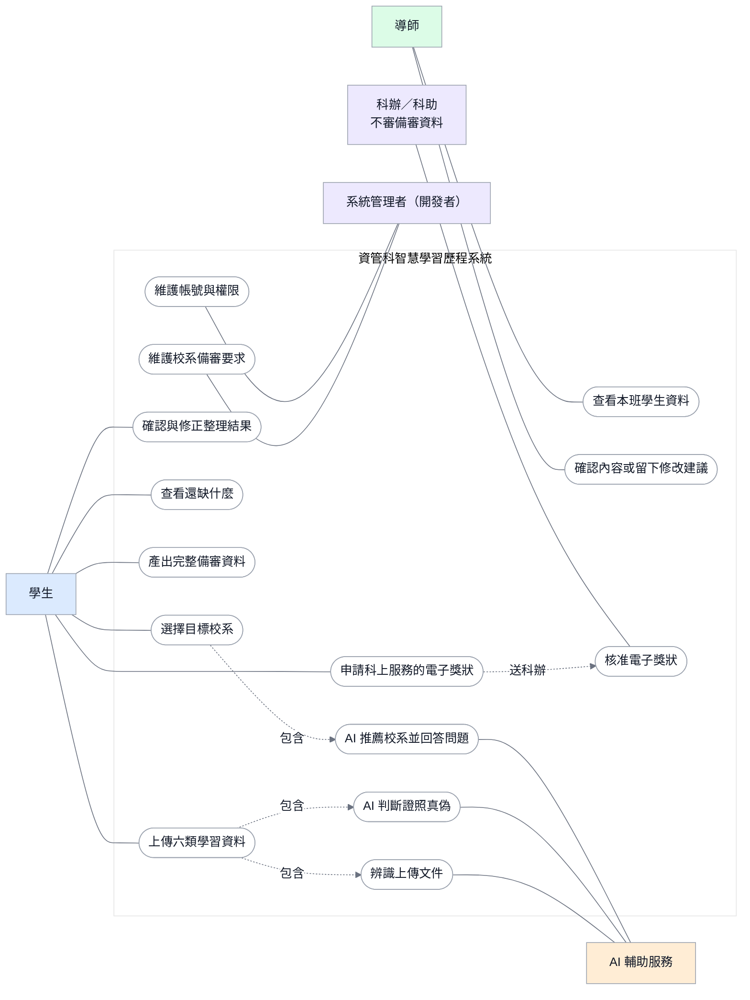
```mermaid
%%{init: {'theme':'base','themeVariables': {'fontFamily':'Microsoft JhengHei, Noto Sans TC, Arial, sans-serif','primaryColor':'#F3F4F6','primaryTextColor':'#111827','primaryBorderColor':'#9CA3AF','lineColor':'#6B7280','edgeLabelBackground':'#FFFFFF'},'flowchart':{'wrappingWidth':400}}}%%
flowchart LR
    classDef student fill:#DBEAFE,stroke:#9CA3AF,color:#111827,stroke-width:1px;
    classDef teacher fill:#DCFCE7,stroke:#9CA3AF,color:#111827,stroke-width:1px;
    classDef admin fill:#EDE9FE,stroke:#9CA3AF,color:#111827,stroke-width:1px;
    classDef ai fill:#FFEDD5,stroke:#9CA3AF,color:#111827,stroke-width:1px;
    classDef usecase fill:#FFFFFF,stroke:#9CA3AF,color:#111827,stroke-width:1px;
    classDef staff fill:#EDE9FE,stroke:#9CA3AF,color:#111827,stroke-width:1px;

    Student[學生]:::student
    Teacher[導師]:::teacher

    subgraph SYS[資管科智慧學習歷程系統]
        direction TB
        UC1([選擇目標校系]):::usecase
        UC2([上傳六類學習資料]):::usecase
        UC3([確認與修正整理結果]):::usecase
        UC4([查看還缺什麼]):::usecase
        UC5([產出完整備審資料]):::usecase
        UC6([查看本班學生資料]):::usecase
        UC7([確認內容或留下修改建議]):::usecase
        UC8([辨識上傳文件]):::usecase
        UC11([AI 判斷證照真偽]):::usecase
        UC12([AI 推薦校系並回答問題]):::usecase
        UC13([核准電子獎狀]):::usecase
        UC14([申請科上服務的電子獎狀]):::usecase
        UC9([維護校系備審要求]):::usecase
        UC10([維護帳號與權限]):::usecase
    end

    Admin[系統管理者（開發者）]:::admin
    AI[AI 輔助服務]:::ai
    Staff[科辦／科助<br/>不審備審資料]:::staff

    Student --- UC1
    Student --- UC2
    Student --- UC3
    Student --- UC4
    Student --- UC5
    Student --- UC14
    UC14 -. 送科辦 .-> UC13
    UC1 -. 包含 .-> UC12
    UC2 -. 包含 .-> UC11
    Teacher --- UC6
    Teacher --- UC7
    UC2 -. 包含 .-> UC8
    UC8 --- AI
    UC11 --- AI
    UC12 --- AI
    Staff --- UC13
    UC9 --- Admin
    UC10 --- Admin
    SYS ~~~ Staff
```

## 圖 5：登入與角色導頁流程圖

依目前程式：帳號不存在、已停用或密碼錯誤時顯示同一個錯誤訊息；帳號沒有可用角色時拒絕登入；登入後每個頁面再用 `role_required` 檢查角色。

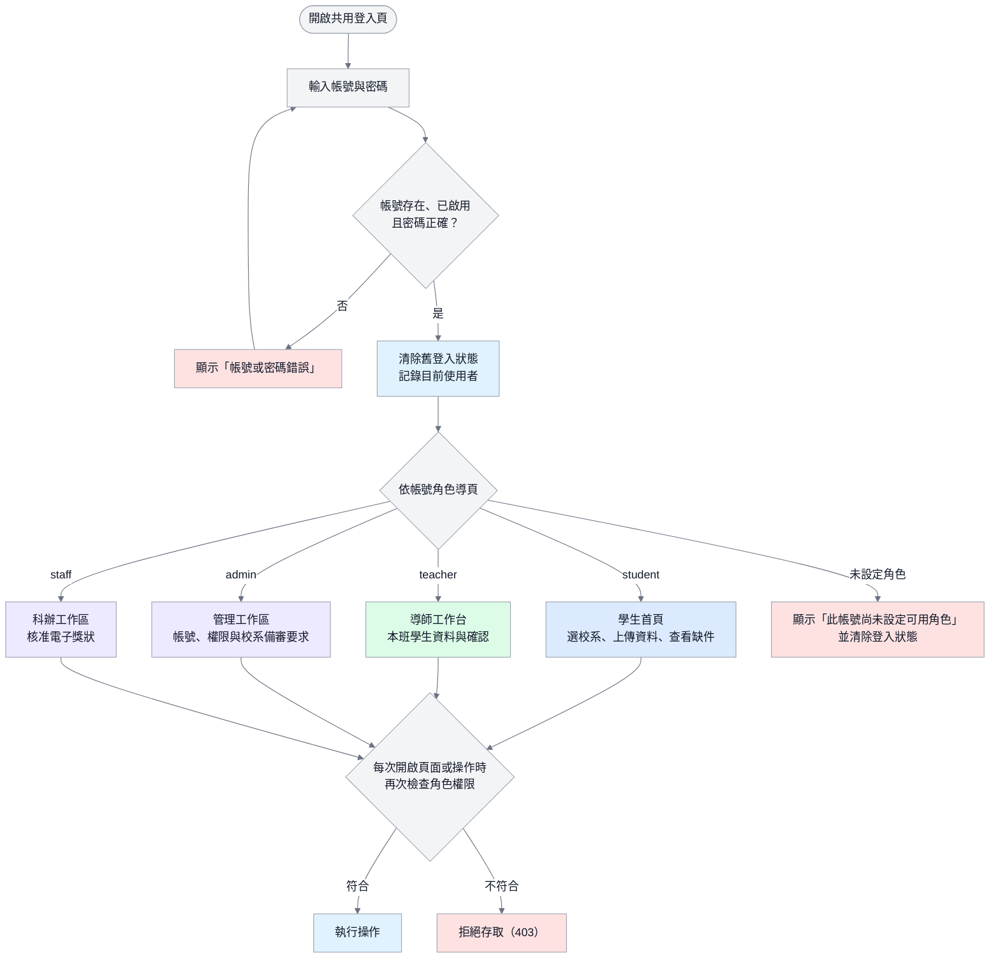
```mermaid
%%{init: {'theme':'base','themeVariables': {'fontFamily':'Microsoft JhengHei, Noto Sans TC, Arial, sans-serif','primaryColor':'#F3F4F6','primaryTextColor':'#111827','primaryBorderColor':'#9CA3AF','lineColor':'#6B7280','edgeLabelBackground':'#FFFFFF'},'flowchart':{'wrappingWidth':400}}}%%
flowchart TD
    classDef system fill:#E0F2FE,stroke:#9CA3AF,color:#111827,stroke-width:1px;
    classDef student fill:#DBEAFE,stroke:#9CA3AF,color:#111827,stroke-width:1px;
    classDef teacher fill:#DCFCE7,stroke:#9CA3AF,color:#111827,stroke-width:1px;
    classDef admin fill:#EDE9FE,stroke:#9CA3AF,color:#111827,stroke-width:1px;
    classDef staff fill:#EDE9FE,stroke:#9CA3AF,color:#111827,stroke-width:1px;
    classDef alert fill:#FEE2E2,stroke:#9CA3AF,color:#111827,stroke-width:1px;
    classDef pending fill:#FFFFFF,stroke:#9CA3AF,color:#6B7280,stroke-width:1px,stroke-dasharray:5 3;

    Start([開啟共用登入頁]) --> Input[輸入帳號與密碼]
    Input --> Auth{帳號存在、已啟用<br/>且密碼正確？}
    Auth -- 否 --> Err[顯示「帳號或密碼錯誤」]:::alert
    Err --> Input
    Auth -- 是 --> Session[清除舊登入狀態<br/>記錄目前使用者]:::system
    Session --> Role{依帳號角色導頁}
    Role -- student --> S[學生首頁<br/>選校系、上傳資料、查看缺件]:::student
    Role -- teacher --> T[導師工作台<br/>本班學生資料與確認]:::teacher
    Role -- admin --> A[管理工作區<br/>帳號、權限與校系備審要求]:::admin
    Role -- staff --> F[科辦工作區<br/>核准電子獎狀]:::staff
    Role -- 未設定角色 --> NoRole[顯示「此帳號尚未設定可用角色」<br/>並清除登入狀態]:::alert
    S --> Guard{每次開啟頁面或操作時<br/>再次檢查角色權限}
    T --> Guard
    A --> Guard
    F --> Guard
    Guard -- 符合 --> Allow[執行操作]:::system
    Guard -- 不符合 --> Deny[拒絕存取（403）]:::alert
```

## 圖 6：學生主線流程圖

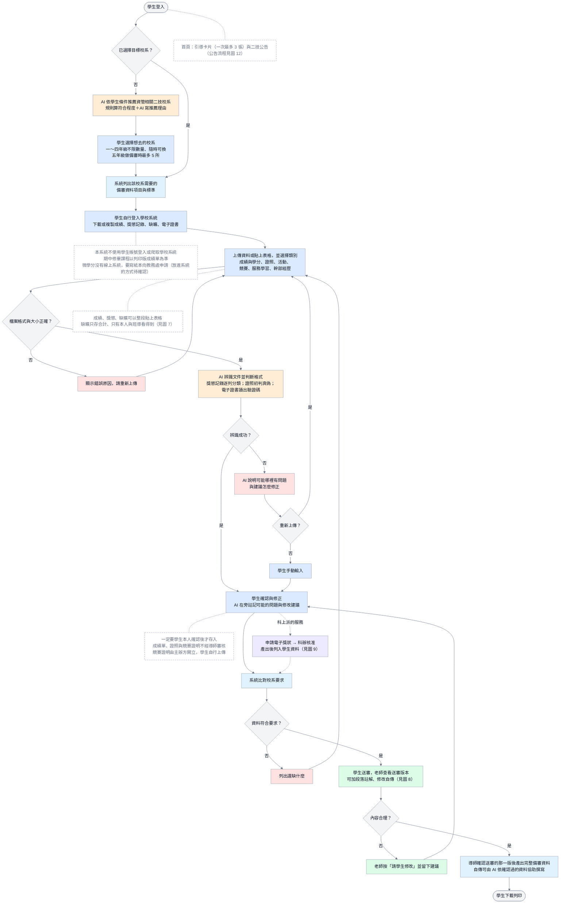
```mermaid
%%{init: {'theme':'base','themeVariables': {'fontFamily':'Microsoft JhengHei, Noto Sans TC, Arial, sans-serif','primaryColor':'#F3F4F6','primaryTextColor':'#111827','primaryBorderColor':'#9CA3AF','lineColor':'#6B7280','edgeLabelBackground':'#FFFFFF'},'flowchart':{'wrappingWidth':400}}}%%
flowchart TD
    classDef student fill:#DBEAFE,stroke:#9CA3AF,color:#111827,stroke-width:1px;
    classDef system fill:#E0F2FE,stroke:#9CA3AF,color:#111827,stroke-width:1px;
    classDef teacher fill:#DCFCE7,stroke:#9CA3AF,color:#111827,stroke-width:1px;
    classDef staff fill:#EDE9FE,stroke:#9CA3AF,color:#111827,stroke-width:1px;
    classDef ai fill:#FFEDD5,stroke:#9CA3AF,color:#111827,stroke-width:1px;
    classDef alert fill:#FEE2E2,stroke:#9CA3AF,color:#111827,stroke-width:1px;
    classDef note fill:#FFFFFF,stroke:#9CA3AF,color:#6B7280,stroke-width:1px,stroke-dasharray:5 3;

    Start([學生登入]) --> HasTarget{已選擇目標校系？}
    Start -.- Home[首頁：引導卡片（一次最多 3 張）與二技公告<br/>（公告流程見圖 12）]:::note
    HasTarget -- 否 --> Recommend[AI 依學生條件推薦資管相關二技校系<br/>規則算符合程度＋AI 寫推薦理由]:::ai
    Recommend --> Choose[學生選擇想去的校系<br/>一～四年級不限數量、隨時可換<br/>五年級做備審時最多 5 所]:::student
    Choose --> Req
    HasTarget -- 是 --> Req[系統列出該校系需要的<br/>備審資料項目與標準]:::system
    Req --> Download[學生自行登入學校系統<br/>下載或複製成績、獎懲記錄、缺曠、電子證書]:::student
    Download -.- Note1[本系統不使用學生帳號登入或爬取學校系統<br/>期中修畢課程以列印版成績單為準<br/>微學分沒有線上系統，要寫紙本向教務處申請（放進系統的方式待確認）]:::note
    Download --> Upload[上傳資料或貼上表格，並選擇類別<br/>成績與學分、證照、活動、<br/>競賽、服務學習、幹部經歷]:::student
    Upload --> FileOK{檔案格式與大小正確？}
    Upload -.- Paste[成績、獎懲、缺曠可以整段貼上表格<br/>缺曠只存合計、只有本人與班導看得到（見圖 7）]:::note
    FileOK -- 否 --> FileErr[顯示錯誤原因，請重新上傳]:::alert
    FileErr --> Upload
    FileOK -- 是 --> Extract[AI 辨識文件並判斷格式<br/>獎懲記錄逐列分類；證照初判真偽；<br/>電子證書讀出驗證碼]:::ai
    Extract --> Recognized{辨識成功？}
    Recognized -- 否 --> Explain[AI 說明可能哪裡有問題<br/>與建議怎麼修正]:::alert
    Explain --> Retry{重新上傳？}
    Retry -- 是 --> Upload
    Retry -- 否 --> Manual[學生手動輸入]:::student
    Recognized -- 是 --> Confirm[學生確認與修正<br/>AI 在旁註記可能的問題與修改建議]:::student
    Manual --> Confirm
    Confirm -.- Note2[一定要學生本人確認後才存入<br/>成績單、證照與競賽證明不經導師審核<br/>競賽證明由主辦方開立，學生自行上傳]:::note
    Confirm --> Compare[系統比對校系要求]:::system
    Confirm -.科上派的服務.-> StaffRec[申請電子獎狀 → 科辦核准<br/>產出後列入學生資料（見圖 9）]:::staff
    StaffRec -.-> Compare
    Compare --> Enough{資料符合要求？}
    Enough -- 否 --> Missing[列出還缺什麼]:::alert
    Missing --> Upload
    Enough -- 是 --> Teacher[學生送審，老師查看送審版本<br/>可加段落註解、修改自傳（見圖 8）]:::teacher
    Teacher --> Reasonable{內容合理？}
    Reasonable -- 否 --> Advice[老師按「請學生修改」並留下建議]:::teacher
    Advice --> Confirm
    Reasonable -- 是 --> Output[導師確認送審的那一版後產出完整備審資料<br/>自傳可由 AI 依確認過的資料協助撰寫]:::system
    Output --> Print([學生下載列印])
```

## 圖 7：學校資料匯入流程圖（2026-10-10 新增）

依 `docs/02_需求與設計/AI_設計規格_學校資料匯入與官網資料來源_2026-10-10.md`：成績（網頁貼上＋紙本 OCR）、獎懲（截圖或貼上）、缺曠（只存合計、只有學生與班導看得到、不送 AI、備審預設不放）；畢業學分檢查依入學年度的修業科目表。

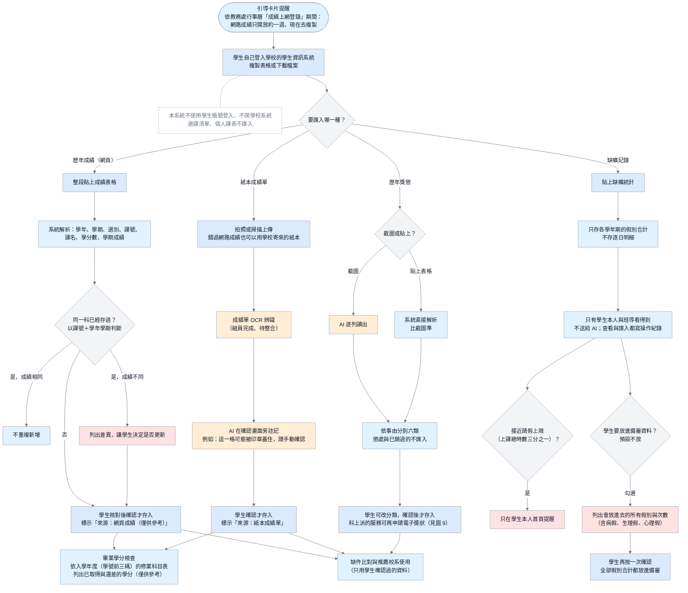
```mermaid
%%{init: {'theme':'base','themeVariables': {'fontFamily':'Microsoft JhengHei, Noto Sans TC, Arial, sans-serif','primaryColor':'#F3F4F6','primaryTextColor':'#111827','primaryBorderColor':'#9CA3AF','lineColor':'#6B7280','edgeLabelBackground':'#FFFFFF'},'flowchart':{'wrappingWidth':400}}}%%
flowchart TD
    classDef student fill:#DBEAFE,stroke:#9CA3AF,color:#111827,stroke-width:1px;
    classDef teacher fill:#DCFCE7,stroke:#9CA3AF,color:#111827,stroke-width:1px;
    classDef system fill:#E0F2FE,stroke:#9CA3AF,color:#111827,stroke-width:1px;
    classDef ai fill:#FFEDD5,stroke:#9CA3AF,color:#111827,stroke-width:1px;
    classDef alert fill:#FEE2E2,stroke:#9CA3AF,color:#111827,stroke-width:1px;
    classDef note fill:#FFFFFF,stroke:#9CA3AF,color:#6B7280,stroke-width:1px,stroke-dasharray:5 3;

    Card([引導卡片提醒<br/>依教務處行事曆「成績上網登錄」期間：<br/>網路成績只開放約一週，現在去複製]):::system --> Login[學生自己登入學校的學生資訊系統<br/>複製表格或下載檔案]:::student
    Login -.- Rule[本系統不使用學生帳號登入、不爬學校系統<br/>選課清單、個人課表不匯入]:::note
    Login --> Kind{要匯入哪一種？}

    Kind -- 歷年成績（網頁） --> PasteGrade[整段貼上成績表格]:::student
    PasteGrade --> ParseGrade[系統解析：學年、學期、選別、課號、<br/>課名、學分數、學期成績]:::system
    ParseGrade --> Dup{同一科已經存過？<br/>以課號＋學年學期判斷}
    Dup -- 是，成績相同 --> Skip[不重複新增]:::system
    Dup -- 是，成績不同 --> Diff[列出差異，讓學生決定是否更新]:::alert
    Dup -- 否 --> GradeConfirm
    Diff --> GradeConfirm[學生核對後確認才存入<br/>標示「來源：網頁成績（僅供參考）」]:::student
    Kind -- 紙本成績單 --> Paper[拍照或掃描上傳<br/>錯過網路成績也可以用學校寄來的紙本]:::student
    Paper --> OCR[成績單 OCR 辨識<br/>（組員完成、待整合）]:::ai
    OCR --> OCRNote[AI 在確認畫面旁註記<br/>例如：這一格可能被印章蓋住，請手動確認]:::ai
    OCRNote --> PaperConfirm[學生確認才存入<br/>標示「來源：紙本成績單」]:::student

    Kind -- 歷年獎懲 --> AwardWay{截圖或貼上？}
    AwardWay -- 截圖 --> AwardAI[AI 逐列讀出]:::ai
    AwardWay -- 貼上表格 --> AwardParse[系統直接解析<br/>比截圖準]:::system
    AwardAI --> AwardSort[依事由分到六類<br/>懲處與已銷過的不匯入]:::system
    AwardParse --> AwardSort
    AwardSort --> AwardConfirm[學生可改分類，確認後才存入<br/>科上派的服務可再申請電子獎狀（見圖 9）]:::student

    Kind -- 缺曠記錄 --> PasteAbs[貼上缺曠統計]:::student
    PasteAbs --> AbsSum[只存各學年期的假別合計<br/>不存逐日明細]:::system
    AbsSum --> AbsSee[只有學生本人與班導看得到<br/>不送給 AI；查看與匯入都寫操作紀錄]:::system
    AbsSee --> AbsWarn{接近請假上限<br/>（上課總時數三分之一）？}
    AbsWarn -- 是 --> AbsAlert[只在學生本人首頁提醒]:::alert
    AbsSee --> AbsPkg{學生要放進備審資料？<br/>預設不放}
    AbsPkg -- 勾選 --> AbsShow[列出會放進去的所有假別與次數<br/>（含病假、生理假、心理假）]:::alert
    AbsShow --> AbsOK[學生再按一次確認<br/>全部假別合計都放進備審]:::student

    GradeConfirm --> Check[畢業學分檢查<br/>依入學年度（學號前三碼）的修業科目表<br/>列出已取得與還差的學分（僅供參考）]:::system
    PaperConfirm --> Check
    GradeConfirm --> Gap[缺件比對與推薦校系使用<br/>（只用學生確認過的資料）]:::system
    PaperConfirm --> Gap
    AwardConfirm --> Gap
```

## 圖 8：導師確認流程圖

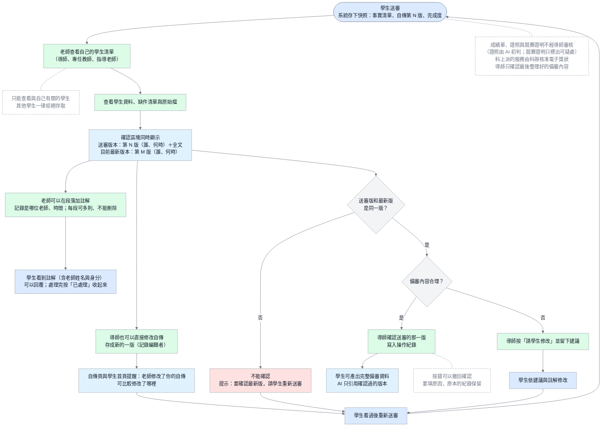
```mermaid
%%{init: {'theme':'base','themeVariables': {'fontFamily':'Microsoft JhengHei, Noto Sans TC, Arial, sans-serif','primaryColor':'#F3F4F6','primaryTextColor':'#111827','primaryBorderColor':'#9CA3AF','lineColor':'#6B7280','edgeLabelBackground':'#FFFFFF'},'flowchart':{'wrappingWidth':400}}}%%
flowchart TD
    classDef student fill:#DBEAFE,stroke:#9CA3AF,color:#111827,stroke-width:1px;
    classDef teacher fill:#DCFCE7,stroke:#9CA3AF,color:#111827,stroke-width:1px;
    classDef system fill:#E0F2FE,stroke:#9CA3AF,color:#111827,stroke-width:1px;
    classDef alert fill:#FEE2E2,stroke:#9CA3AF,color:#111827,stroke-width:1px;
    classDef pending fill:#FFFFFF,stroke:#9CA3AF,color:#6B7280,stroke-width:1px,stroke-dasharray:5 3;

    Submit([學生送審<br/>系統存下快照：事實清單、自傳第 N 版、完成度]):::student --> List[老師查看自己的學生清單<br/>（導師、專任教師、指導老師）]:::teacher
    List -.- Scope[只能查看與自己有關的學生<br/>其他學生一律拒絕存取]:::pending
    Submit -.- NoCert[成績單、證照與競賽證明不經導師審核<br/>（證照由 AI 初判；競賽證明只標出可疑處）<br/>科上派的服務由科辦核准電子獎狀<br/>導師只確認最後整理好的備審內容]:::pending
    List --> View[查看學生資料、缺件清單與原始檔]:::teacher
    View --> Versions[確認區塊同時顯示<br/>送審版本：第 N 版（誰、何時）＋全文<br/>目前最新版本：第 M 版（誰、何時）]:::system
    Versions --> Comment[老師可以在段落加註解<br/>記錄是哪位老師、時間；每段可多則、不能刪除]:::teacher
    Comment --> Reply[學生看到註解（含老師姓名與身分）<br/>可以回覆；處理完按「已處理」收起來]:::student
    Versions --> Edit[導師也可以直接修改自傳<br/>存成新的一版（記錄編輯者）]:::teacher
    Edit --> Notify[自傳頁與學生首頁提醒：老師修改了你的自傳<br/>可比較修改了哪裡]:::system
    Notify --> Resubmit[學生看過後重新送審]:::student
    Resubmit --> Submit
    Versions --> Same{送審版和最新版<br/>是同一版？}
    Same -- 否 --> Block[不能確認<br/>提示：要確認最新版，請學生重新送審]:::alert
    Block --> Resubmit
    Same -- 是 --> Reasonable{備審內容合理？}
    Reasonable -- 是 --> Confirm[導師確認送審的那一版<br/>寫入操作紀錄]:::teacher
    Confirm --> Ready[學生可產出完整備審資料<br/>AI 只引用確認過的版本]:::system
    Reasonable -- 否 --> Advice[導師按「請學生修改」並留下建議]:::teacher
    Advice --> Fix[學生依建議與註解修改]:::student
    Fix --> Resubmit
    Confirm -.- Withdraw[按錯可以撤回確認<br/>要填原因，原本的紀錄保留]:::pending
```

## 圖 9：科辦核准電子獎狀流程圖

依 2026-10-07 錄音討論與 2026-10-08 使用者決定：科上派的服務記在學校統整的獎懲記錄（正式紀錄），但每件服務沒有個別獎狀。學生從獎懲記錄勾選並申請，科辦對照後核准，系統依固定外框、可編輯內文的範本產出含驗證碼的電子獎狀。電子獎狀是補充，不取代獎懲記錄；科辦不審備審資料。

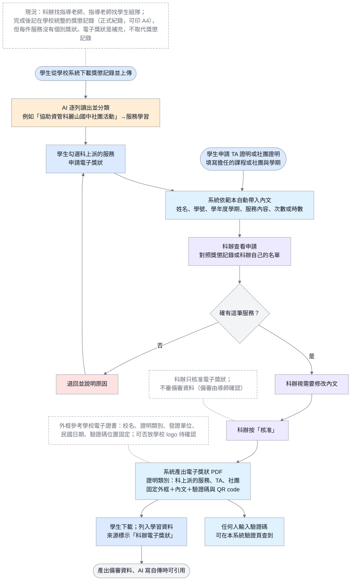
```mermaid
%%{init: {'theme':'base','themeVariables': {'fontFamily':'Microsoft JhengHei, Noto Sans TC, Arial, sans-serif','primaryColor':'#F3F4F6','primaryTextColor':'#111827','primaryBorderColor':'#9CA3AF','lineColor':'#6B7280','edgeLabelBackground':'#FFFFFF'},'flowchart':{'wrappingWidth':400}}}%%
flowchart TD
    classDef student fill:#DBEAFE,stroke:#9CA3AF,color:#111827,stroke-width:1px;
    classDef staff fill:#EDE9FE,stroke:#9CA3AF,color:#111827,stroke-width:1px;
    classDef system fill:#E0F2FE,stroke:#9CA3AF,color:#111827,stroke-width:1px;
    classDef ai fill:#FFEDD5,stroke:#9CA3AF,color:#111827,stroke-width:1px;
    classDef alert fill:#FEE2E2,stroke:#9CA3AF,color:#111827,stroke-width:1px;
    classDef note fill:#FFFFFF,stroke:#9CA3AF,color:#6B7280,stroke-width:1px,stroke-dasharray:5 3;

    Start([學生從學校系統下載獎懲記錄並上傳]):::student --> Read[AI 逐列讀出並分類<br/>例如「協助資管科麗山國中社團活動」→服務學習]:::ai
    Read --> Pick[學生勾選科上派的服務<br/>申請電子獎狀]:::student
    Other([學生申請 TA 證明或社團證明<br/>填寫擔任的課程或社團與學期]):::student --> Draft
    Pick --> Draft[系統依範本自動帶入內文<br/>姓名、學號、學年度學期、服務內容、次數或時數]:::system
    Draft --> Review[科辦查看申請<br/>對照獎懲記錄或科辦自己的名單]:::staff
    Review --> Valid{確有這筆服務？}
    Valid -- 否 --> Return[退回並說明原因]:::alert
    Return --> Pick
    Valid -- 是 --> Edit[科辦視需要修改內文]:::staff
    Edit --> Approve[科辦按「核准」]:::staff
    Approve --> Cert[系統產出電子獎狀 PDF<br/>證明類別：科上派的服務、TA、社團<br/>固定外框＋內文＋驗證碼與 QR code]:::system
    Cert --> Student[學生下載；列入學習資料<br/>來源標示「科辦電子獎狀」]:::student
    Cert --> Verify[任何人輸入驗證碼<br/>可在本系統驗證頁查到]:::system
    Student --> Package([產出備審資料、AI 寫自傳時可引用])
    Note1[現況：科辦找指導老師、指導老師找學生組隊；<br/>完成後記在學校統整的獎懲記錄（正式紀錄，可印 A4），<br/>但每件服務沒有個別獎狀。電子獎狀是補充，不取代獎懲記錄]:::note -.- Start
    Note2[科辦只核准電子獎狀；<br/>不審備審資料（備審由導師確認）]:::note -.- Approve
    Note3[外框參考學校電子證書：校名、證明類別、發證單位、<br/>民國日期、驗證碼位置固定；可否放學校 logo 待確認]:::note -.- Cert
```

## 圖 10：科辦表單下載區流程圖

依 `docs/02_需求與設計/AI_設計規格_科辦表單區_下載與收件_2026-10-08.md` 第十一點第 1 步（下載區）。收件（繳回系統、退件）2026-10-09 暫停，不在本版。舊的「行政表單數位化與申請追蹤流程圖」與舊圖 7「專題共同審查流程圖」和 10-10 的決定衝突，已搬到 `99_封存_歷史與待確認/03_舊版流程圖與圖片/`（`D-11-admin-forms-flow`、`D-03-group-project-review-flow`）。

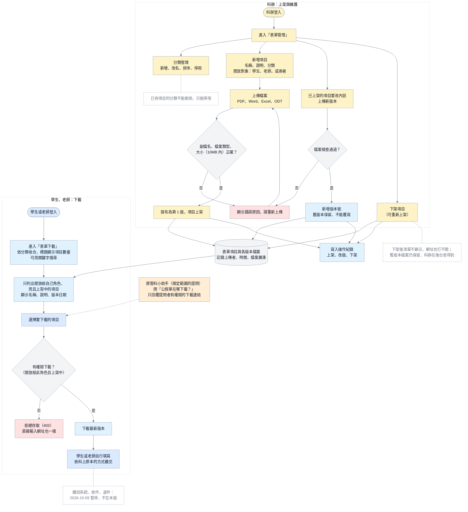
```mermaid
%%{init: {'theme':'base','themeVariables': {'fontFamily':'Microsoft JhengHei, Noto Sans TC, Arial, sans-serif','primaryColor':'#F3F4F6','primaryTextColor':'#111827','primaryBorderColor':'#9CA3AF','lineColor':'#6B7280','edgeLabelBackground':'#FFFFFF'},'flowchart':{'wrappingWidth':400}}}%%
flowchart TD
    classDef student fill:#DBEAFE,stroke:#9CA3AF,color:#111827,stroke-width:1px;
    classDef teacher fill:#DCFCE7,stroke:#9CA3AF,color:#111827,stroke-width:1px;
    classDef staff fill:#FEF3C7,stroke:#9CA3AF,color:#111827,stroke-width:1px;
    classDef system fill:#E0F2FE,stroke:#9CA3AF,color:#111827,stroke-width:1px;
    classDef store fill:#F3F4F6,stroke:#9CA3AF,color:#111827,stroke-width:1px;
    classDef ai fill:#FFEDD5,stroke:#9CA3AF,color:#111827,stroke-width:1px;
    classDef alert fill:#FEE2E2,stroke:#9CA3AF,color:#111827,stroke-width:1px;
    classDef pending fill:#FFFFFF,stroke:#9CA3AF,color:#6B7280,stroke-width:1px,stroke-dasharray:5 3;

    subgraph StaffSide[科辦：上架與維護]
        SLogin([科辦登入]):::staff --> Manage[進入「表單管理」]:::staff
        Manage --> Category[分類管理<br/>新增、改名、排序、停用]:::staff
        Category -.- CatRule[已有項目的分類不能刪除，只能停用]:::pending
        Manage --> NewItem[新增項目<br/>名稱、說明、分類<br/>開放對象：學生、老師，或兩者]:::staff
        NewItem --> UploadFile[上傳檔案<br/>PDF、Word、Excel、ODT]:::staff
        UploadFile --> FileOK{副檔名、檔案類型、<br/>大小（10MB 內）正確？}
        FileOK -- 否 --> FileErr[顯示錯誤原因，請重新上傳]:::alert
        FileErr --> UploadFile
        FileOK -- 是 --> Publish[發布為第 1 版，項目上架]:::staff
        Manage --> Revise[已上架的項目要改內容<br/>上傳新版本]:::staff
        Revise --> FileOK2{檔案檢查通過？}
        FileOK2 -- 否 --> FileErr
        FileOK2 -- 是 --> NewVersion[新增版本號<br/>舊版本保留、不能覆寫]:::system
        Manage --> Unlist[下架項目<br/>（可重新上架）]:::staff
    end

    Publish --> Store[(表單項目與各版本檔案<br/>記錄上傳者、時間、檔案雜湊)]:::store
    NewVersion --> Store
    Unlist --> Store
    Publish --> Log[寫入操作紀錄<br/>上架、改版、下架]:::system
    NewVersion --> Log
    Unlist --> Log

    subgraph UserSide[學生、老師：下載]
        ULogin([學生或老師登入]):::student --> List[進入「表單下載」<br/>依分類收合，標題顯示項目數量<br/>可用關鍵字搜尋]:::system
        List --> Filter[只列出開放給自己角色、<br/>而且上架中的項目<br/>顯示名稱、說明、版本日期]:::system
        Filter --> Pick[選擇要下載的項目]:::student
        Pick --> Allowed{有權限下載？<br/>（開放給此角色且上架中）}
        Allowed -- 否 --> Deny[拒絕存取（403）<br/>直接輸入網址也一樣]:::alert
        Allowed -- 是 --> Download[下載最新版本]:::system
        Download --> Offline[學生或老師自行填寫<br/>依科上原本的方式繳交]:::student
    end

    Store --> Filter
    Ask[資管科小助手（限定範圍的提問）<br/>問「公假單在哪下載？」<br/>只回覆提問者有權限的下載連結]:::ai -.-> Pick
    Offline -.- NoCollect[繳回系統、收件、退件：<br/>2026-10-09 暫停，不在本版]:::pending
    Unlist -.- UnlistRule[下架後清單不顯示，網址也打不開；<br/>舊版本檔案仍保留，科辦在後台查得到]:::pending
```

## 圖 11：招生資料更新流程圖

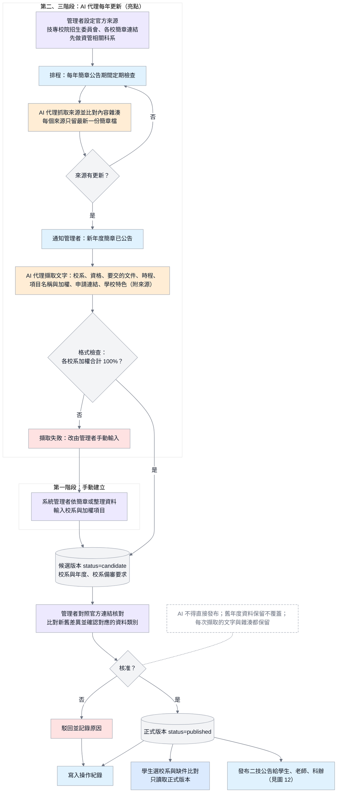
```mermaid
%%{init: {'theme':'base','themeVariables': {'fontFamily':'Microsoft JhengHei, Noto Sans TC, Arial, sans-serif','primaryColor':'#F3F4F6','primaryTextColor':'#111827','primaryBorderColor':'#9CA3AF','lineColor':'#6B7280','edgeLabelBackground':'#FFFFFF'},'flowchart':{'wrappingWidth':400}}}%%
flowchart TD
    classDef admin fill:#EDE9FE,stroke:#9CA3AF,color:#111827,stroke-width:1px;
    classDef ai fill:#FFEDD5,stroke:#9CA3AF,color:#111827,stroke-width:1px;
    classDef system fill:#E0F2FE,stroke:#9CA3AF,color:#111827,stroke-width:1px;
    classDef store fill:#F3F4F6,stroke:#9CA3AF,color:#111827,stroke-width:1px;
    classDef student fill:#DBEAFE,stroke:#9CA3AF,color:#111827,stroke-width:1px;
    classDef alert fill:#FEE2E2,stroke:#9CA3AF,color:#111827,stroke-width:1px;
    classDef note fill:#FFFFFF,stroke:#9CA3AF,color:#6B7280,stroke-width:1px,stroke-dasharray:5 3;

    subgraph Stage1[第一階段：手動建立]
        Manual[系統管理者依簡章或整理資料<br/>輸入校系與加權項目]:::admin
    end
    subgraph Stage23[第二、三階段：AI 代理每年更新（亮點）]
        Source[管理者設定官方來源<br/>技專校院招生委員會、各校簡章連結<br/>先做資管相關科系]:::admin
        Schedule[排程：每年簡章公告期間定期檢查]:::system
        Detect[AI 代理抓取來源並比對內容雜湊<br/>每個來源只留最新一份簡章檔]:::ai
        Changed{來源有更新？}
        Notify[通知管理者：新年度簡章已公告]:::system
        Extract[AI 代理擷取文字：校系、資格、要交的文件、時程、<br/>項目名稱與加權、申請連結、學校特色（附來源）]:::ai
        Validate{格式檢查：<br/>各校系加權合計 100%？}
        Fail[擷取失敗：改由管理者手動輸入]:::alert
        Source --> Schedule --> Detect --> Changed
        Changed -- 否 --> Schedule
        Changed -- 是 --> Notify --> Extract --> Validate
        Validate -- 否 --> Fail
    end
    Manual --> Candidate[(候選版本 status=candidate<br/>校系與年度、校系備審要求)]:::store
    Validate -- 是 --> Candidate
    Fail --> Manual
    Candidate --> Diff[管理者對照官方連結核對<br/>比對新舊差異並確認對應的資料類別]:::admin
    Diff --> Approve{核准？}
    Approve -- 否 --> Reject[駁回並記錄原因]:::alert
    Approve -- 是 --> Publish[(正式版本 status=published)]:::store
    Publish --> Student[學生選校系與缺件比對<br/>只讀取正式版本]:::student
    Publish --> Announce[發布二技公告給學生、老師、科辦<br/>（見圖 12）]:::system
    Reject --> Log[寫入操作紀錄]:::system
    Publish --> Log
    Rule[AI 不得直接發布；舊年度資料保留不覆蓋；<br/>每次擷取的文字與雜湊都保留]:::note -.- Approve
```

## 圖 12：二技招生公告與 AI 推薦校系流程圖

依 `docs/02_需求與設計/AI_設計規格_二技公告與AI推薦校系_2026-10-10.md`。資料更新的前半段見圖 11。

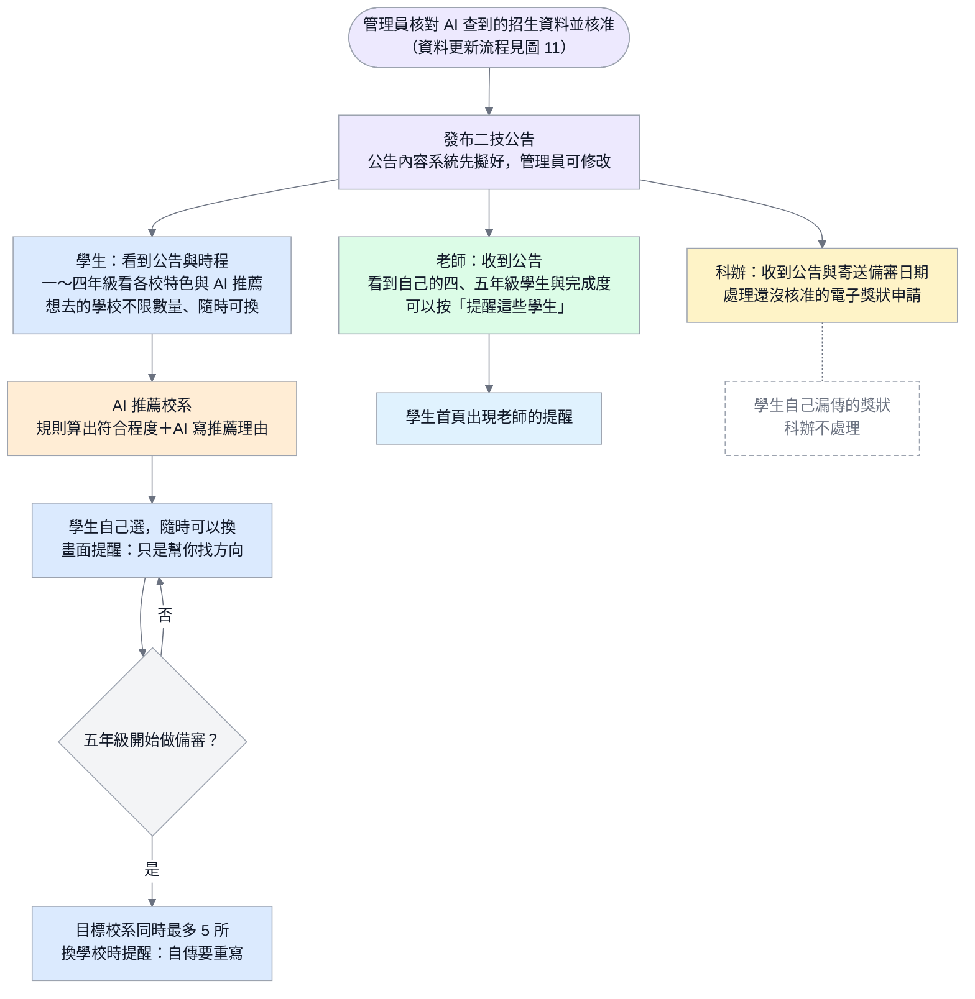
```mermaid
%%{init: {'theme':'base','themeVariables': {'fontFamily':'Microsoft JhengHei, Noto Sans TC, Arial, sans-serif','primaryColor':'#F3F4F6','primaryTextColor':'#111827','primaryBorderColor':'#9CA3AF','lineColor':'#6B7280','edgeLabelBackground':'#FFFFFF'},'flowchart':{'wrappingWidth':400}}}%%
flowchart TD
    classDef student fill:#DBEAFE,stroke:#9CA3AF,color:#111827,stroke-width:1px;
    classDef teacher fill:#DCFCE7,stroke:#9CA3AF,color:#111827,stroke-width:1px;
    classDef admin fill:#EDE9FE,stroke:#9CA3AF,color:#111827,stroke-width:1px;
    classDef staff fill:#FEF3C7,stroke:#9CA3AF,color:#111827,stroke-width:1px;
    classDef system fill:#E0F2FE,stroke:#9CA3AF,color:#111827,stroke-width:1px;
    classDef ai fill:#FFEDD5,stroke:#9CA3AF,color:#111827,stroke-width:1px;
    classDef pending fill:#FFFFFF,stroke:#9CA3AF,color:#6B7280,stroke-width:1px,stroke-dasharray:5 3;

    Approve([管理員核對 AI 查到的招生資料並核准<br/>（資料更新流程見圖 11）]):::admin --> Publish[發布二技公告<br/>公告內容系統先擬好，管理員可修改]:::admin
    Publish --> Student[學生：看到公告與時程<br/>一～四年級看各校特色與 AI 推薦<br/>想去的學校不限數量、隨時可換]:::student
    Publish --> Teacher[老師：收到公告<br/>看到自己的四、五年級學生與完成度<br/>可以按「提醒這些學生」]:::teacher
    Publish --> Staff[科辦：收到公告與寄送備審日期<br/>處理還沒核准的電子獎狀申請]:::staff
    Student --> Recommend[AI 推薦校系<br/>規則算出符合程度＋AI 寫推薦理由]:::ai
    Recommend --> Choose[學生自己選，隨時可以換<br/>畫面提醒：只是幫你找方向]:::student
    Choose --> Grade5{五年級開始做備審？}
    Grade5 -- 否 --> Choose
    Grade5 -- 是 --> Limit[目標校系同時最多 5 所<br/>換學校時提醒：自傳要重寫]:::student
    Teacher --> Remind[學生首頁出現老師的提醒]:::system
    Staff -.- NotStaff[學生自己漏傳的獎狀<br/>科辦不處理]:::pending
```

## 圖 13：官網資料來源、資料分類與來源維護流程圖（2026-10-10 新增）

資管科官網、資圖中心、教務處行事曆照二技公告的機制：AI 代理只抓登記的頁面、只存文字與連結並擬分類，管理員核對後才給學生看；來源失效時在「資料來源維護」頁標紅。

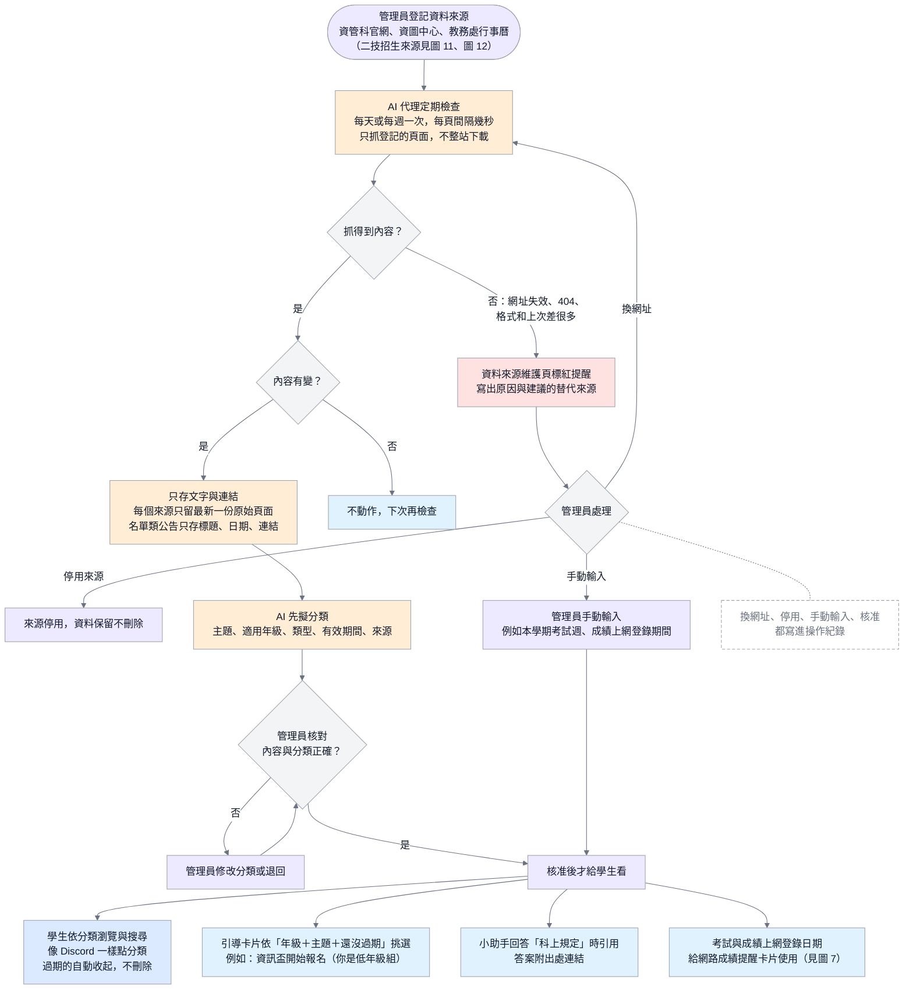
```mermaid
%%{init: {'theme':'base','themeVariables': {'fontFamily':'Microsoft JhengHei, Noto Sans TC, Arial, sans-serif','primaryColor':'#F3F4F6','primaryTextColor':'#111827','primaryBorderColor':'#9CA3AF','lineColor':'#6B7280','edgeLabelBackground':'#FFFFFF'},'flowchart':{'wrappingWidth':400}}}%%
flowchart TD
    classDef student fill:#DBEAFE,stroke:#9CA3AF,color:#111827,stroke-width:1px;
    classDef teacher fill:#DCFCE7,stroke:#9CA3AF,color:#111827,stroke-width:1px;
    classDef admin fill:#EDE9FE,stroke:#9CA3AF,color:#111827,stroke-width:1px;
    classDef system fill:#E0F2FE,stroke:#9CA3AF,color:#111827,stroke-width:1px;
    classDef ai fill:#FFEDD5,stroke:#9CA3AF,color:#111827,stroke-width:1px;
    classDef alert fill:#FEE2E2,stroke:#9CA3AF,color:#111827,stroke-width:1px;
    classDef note fill:#FFFFFF,stroke:#9CA3AF,color:#6B7280,stroke-width:1px,stroke-dasharray:5 3;

    Register([管理員登記資料來源<br/>資管科官網、資圖中心、教務處行事曆<br/>（二技招生來源見圖 11、圖 12）]):::admin --> Check[AI 代理定期檢查<br/>每天或每週一次，每頁間隔幾秒<br/>只抓登記的頁面，不整站下載]:::ai
    Check --> Health{抓得到內容？}
    Health -- 否：網址失效、404、<br/>格式和上次差很多 --> Red[資料來源維護頁標紅提醒<br/>寫出原因與建議的替代來源]:::alert
    Red --> Fix{管理員處理}
    Fix -- 換網址 --> Check
    Fix -- 停用來源 --> Off[來源停用，資料保留不刪除]:::admin
    Fix -- 手動輸入 --> Manual[管理員手動輸入<br/>例如本學期考試週、成績上網登錄期間]:::admin
    Health -- 是 --> Changed{內容有變？}
    Changed -- 否 --> Wait[不動作，下次再檢查]:::system
    Changed -- 是 --> Extract[只存文字與連結<br/>每個來源只留最新一份原始頁面<br/>名單類公告只存標題、日期、連結]:::ai
    Extract --> Classify[AI 先擬分類<br/>主題、適用年級、類型、有效期間、來源]:::ai
    Classify --> Verify{管理員核對<br/>內容與分類正確？}
    Verify -- 否 --> Edit[管理員修改分類或退回]:::admin
    Edit --> Verify
    Verify -- 是 --> Publish[核准後才給學生看]:::admin
    Manual --> Publish
    Publish --> Browse[學生依分類瀏覽與搜尋<br/>像 Discord 一樣點分類<br/>過期的自動收起，不刪除]:::student
    Publish --> Cards[引導卡片依「年級＋主題＋還沒過期」挑選<br/>例如：資訊盃開始報名（你是低年級組）]:::system
    Publish --> Helper[小助手回答「科上規定」時引用<br/>答案附出處連結]:::system
    Publish --> Dates[考試與成績上網登錄日期<br/>給網路成績提醒卡片使用（見圖 7）]:::system
    Fix -.- Log[換網址、停用、手動輸入、核准<br/>都寫進操作紀錄]:::note
```

## 圖 14：系統管理者維護校系備審要求流程圖

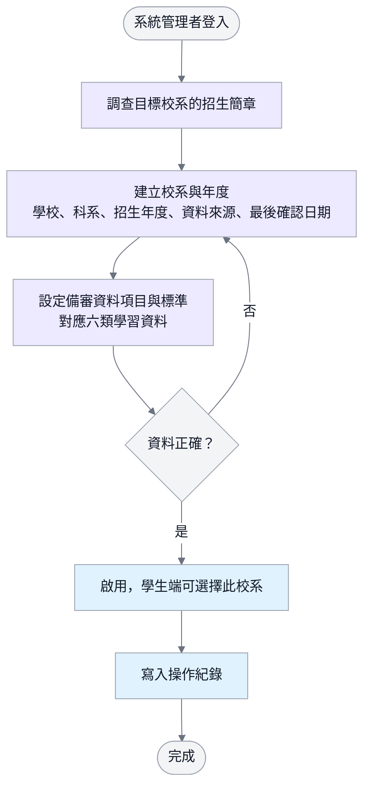
```mermaid
%%{init: {'theme':'base','themeVariables': {'fontFamily':'Microsoft JhengHei, Noto Sans TC, Arial, sans-serif','primaryColor':'#F3F4F6','primaryTextColor':'#111827','primaryBorderColor':'#9CA3AF','lineColor':'#6B7280','edgeLabelBackground':'#FFFFFF'},'flowchart':{'wrappingWidth':400}}}%%
flowchart TD
    classDef student fill:#DBEAFE,stroke:#9CA3AF,color:#111827,stroke-width:1px;
    classDef teacher fill:#DCFCE7,stroke:#9CA3AF,color:#111827,stroke-width:1px;
    classDef admin fill:#EDE9FE,stroke:#9CA3AF,color:#111827,stroke-width:1px;
    classDef system fill:#E0F2FE,stroke:#9CA3AF,color:#111827,stroke-width:1px;
    classDef store fill:#F3F4F6,stroke:#9CA3AF,color:#111827,stroke-width:1px;
    classDef ai fill:#FFEDD5,stroke:#9CA3AF,color:#111827,stroke-width:1px;
    classDef alert fill:#FEE2E2,stroke:#9CA3AF,color:#111827,stroke-width:1px;
    classDef pending fill:#FFFFFF,stroke:#9CA3AF,color:#6B7280,stroke-width:1px,stroke-dasharray:5 3;

    Start([系統管理者登入]) --> Survey[調查目標校系的招生簡章]:::admin
    Survey --> Program[建立校系與年度<br/>學校、科系、招生年度、資料來源、最後確認日期]:::admin
    Program --> Items[設定備審資料項目與標準<br/>對應六類學習資料]:::admin
    Items --> Correct{資料正確？}
    Correct -- 否 --> Program
    Correct -- 是 --> Publish[啟用，學生端可選擇此校系]:::system
    Publish --> Log[寫入操作紀錄]:::system
    Log --> End([完成])
```

## 圖 15：角色與責任圖


```mermaid
%%{init: {'theme':'base','themeVariables': {'fontFamily':'Microsoft JhengHei, Noto Sans TC, Arial, sans-serif','primaryColor':'#F3F4F6','primaryTextColor':'#111827','primaryBorderColor':'#9CA3AF','lineColor':'#6B7280','edgeLabelBackground':'#FFFFFF'},'flowchart':{'wrappingWidth':400}}}%%
flowchart TD
    classDef student fill:#DBEAFE,stroke:#9CA3AF,color:#111827,stroke-width:1px;
    classDef teacher fill:#DCFCE7,stroke:#9CA3AF,color:#111827,stroke-width:1px;
    classDef staff fill:#EDE9FE,stroke:#9CA3AF,color:#111827,stroke-width:1px;
    classDef ai fill:#FEF3C7,stroke:#9CA3AF,color:#111827,stroke-width:1px;
    classDef alert fill:#FEE2E2,stroke:#9CA3AF,color:#111827,stroke-width:1px;

    Student[學生]:::student --> S1[上傳或貼上成績、獎懲、缺曠<br/>校正與確認本人資料]:::student
    Student --> S2[產出並下載完整備審資料]:::student
    Student --> S3[看引導卡片與二技公告<br/>選想去的學校、回覆老師的註解<br/>依分類瀏覽學校資訊、下載表單]:::student
    Teacher[老師<br/>導師、專任教師、指導老師]:::teacher --> T1[查看與自己有關的學生資料<br/>收到二技公告並提醒學生]:::teacher
    Teacher --> T2[段落註解、修改自傳<br/>導師確認學生送審的那一版]:::teacher
    Staff[科辦／科助]:::staff --> F1[審核電子獎狀申請<br/>科上派的服務、TA 證明、社團證明]:::staff
    Staff --> F2[編輯內文後核准<br/>系統產出含驗證碼的電子獎狀]:::staff
    Staff --> F3[收到二技公告與寄送備審日期<br/>管理表單下載區：上架、改版、下架]:::staff
    Staff -.不審備審資料.-> T2
    Admin[系統管理者（開發者）]:::staff --> A1[管理帳號、班級導師與校系備審要求<br/>核對 AI 查到的招生資料並發布二技公告<br/>資料來源維護、核對資料分類、查詢操作紀錄]:::staff
    Agent[AI Agent]:::ai --> G1[查二技招生資料（候選）、寫推薦校系理由、<br/>辨識文件並在旁註記修改建議、判斷證照真偽、<br/>讀獎懲記錄並分類、依確認過的資料協助寫自傳、<br/>回答限定範圍的提問（操作、科上規定、個人進度）、<br/>官網資料擬分類（候選）；不讀缺曠資料]:::ai
    G1 -.不直接定案.-> Block[必須經學生或人工確認]:::alert
```

## 圖 16：系統架構圖

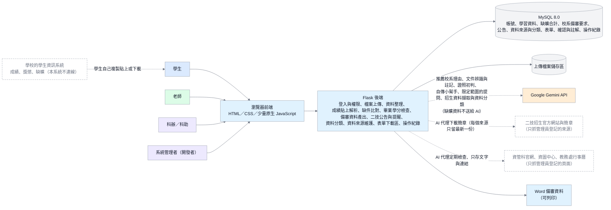
```mermaid
%%{init: {'theme':'base','themeVariables': {'fontFamily':'Microsoft JhengHei, Noto Sans TC, Arial, sans-serif','primaryColor':'#F3F4F6','primaryTextColor':'#111827','primaryBorderColor':'#9CA3AF','lineColor':'#6B7280','edgeLabelBackground':'#FFFFFF'},'flowchart':{'wrappingWidth':400}}}%%
flowchart LR
    classDef student fill:#DBEAFE,stroke:#9CA3AF,color:#111827,stroke-width:1px;
    classDef teacher fill:#DCFCE7,stroke:#9CA3AF,color:#111827,stroke-width:1px;
    classDef admin fill:#EDE9FE,stroke:#9CA3AF,color:#111827,stroke-width:1px;
    classDef backend fill:#E0F2FE,stroke:#9CA3AF,color:#111827,stroke-width:1px;
    classDef db fill:#F3F4F6,stroke:#9CA3AF,color:#111827,stroke-width:1px;
    classDef ai fill:#FFEDD5,stroke:#9CA3AF,color:#111827,stroke-width:1px;
    classDef external fill:#FFFFFF,stroke:#9CA3AF,color:#6B7280,stroke-width:1px,stroke-dasharray:5 3;

    School[學校的學生資訊系統<br/>成績、獎懲、缺曠（本系統不連線）]:::external
    Campus[資管科官網、資圖中心、教務處行事曆<br/>（只抓管理員登記的頁面）]:::external
    Official[二技招生官方網站與簡章<br/>（只抓管理員登記的來源）]:::external
    Student[學生]:::student
    Teacher[老師]:::teacher
    Staff[科辦／科助]:::admin
    Admin[系統管理者（開發者）]:::admin

    School -. 學生自己複製貼上或下載 .-> Student
    Student --> UI
    Teacher --> UI
    Staff --> UI
    Admin --> UI

    UI[瀏覽器前端<br/>HTML／CSS／少量原生 JavaScript]:::backend
    UI --> App[Flask 後端<br/>登入與權限、檔案上傳、資料整理、<br/>成績貼上解析、缺件比對、畢業學分檢查、<br/>備審資料產出、二技公告與提醒、<br/>資料分類、資料來源維護、表單下載區、操作紀錄]:::backend
    App --> DB[(MySQL 8.0<br/>帳號、學習資料、缺曠合計、校系備審要求、<br/>公告、資料來源與分類、表單、確認與註解、操作紀錄)]:::db
    App --> Files[(上傳檔案儲存區)]:::db
    App -. 推薦校系理由、文件辨識與註記、證照初判、<br/>自傳小幫手、限定範圍的提問、招生資料擷取與資料分類<br/>（缺曠資料不送給 AI） .-> Gemini[Google Gemini API]:::ai
    App -. AI 代理下載簡章（每個來源只留最新一份） .-> Official
    App -. AI 代理定期檢查、只存文字與連結 .-> Campus
    App --> Doc[Word 備審資料<br/>（可列印）]:::backend
```

## 圖 17：DFD 資料流程圖

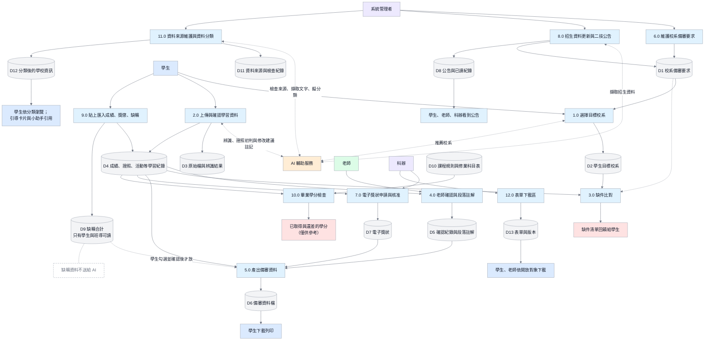
```mermaid
%%{init: {'theme':'base','themeVariables': {'fontFamily':'Microsoft JhengHei, Noto Sans TC, Arial, sans-serif','primaryColor':'#F3F4F6','primaryTextColor':'#111827','primaryBorderColor':'#9CA3AF','lineColor':'#6B7280','edgeLabelBackground':'#FFFFFF'},'flowchart':{'wrappingWidth':400}}}%%
flowchart TD
    classDef student fill:#DBEAFE,stroke:#9CA3AF,color:#111827,stroke-width:1px;
    classDef teacher fill:#DCFCE7,stroke:#9CA3AF,color:#111827,stroke-width:1px;
    classDef admin fill:#EDE9FE,stroke:#9CA3AF,color:#111827,stroke-width:1px;
    classDef system fill:#E0F2FE,stroke:#9CA3AF,color:#111827,stroke-width:1px;
    classDef store fill:#F3F4F6,stroke:#9CA3AF,color:#111827,stroke-width:1px;
    classDef ai fill:#FFEDD5,stroke:#9CA3AF,color:#111827,stroke-width:1px;
    classDef alert fill:#FEE2E2,stroke:#9CA3AF,color:#111827,stroke-width:1px;
    classDef pending fill:#FFFFFF,stroke:#9CA3AF,color:#6B7280,stroke-width:1px,stroke-dasharray:5 3;

    Admin[系統管理者]:::admin --> P6[6.0 維護校系備審要求]:::system
    P6 --> D1[(D1 校系備審要求)]:::store
    D1 --> P1[1.0 選擇目標校系]:::system
    Student[學生]:::student --> P1
    P1 --> D2[(D2 學生目標校系)]:::store
    Student --> P2[2.0 上傳與確認學習資料]:::system
    P2 <-. 辨識、證照初判與修改建議註記 .-> AI[AI 輔助服務]:::ai
    P1 <-. 推薦校系 .-> AI
    P2 --> D3[(D3 原始檔與辨識結果)]:::store
    P2 --> D4[(D4 成績、證照、活動等學習紀錄)]:::store
    D2 --> P3[3.0 缺件比對]:::system
    D4 --> P3
    D1 -.-> P3
    P3 --> Gap[缺件清單回饋給學生]:::alert
    D4 --> P4[4.0 老師確認與段落註解]:::system
    Teacher[老師]:::teacher --> P4
    P4 --> D5[(D5 確認紀錄與段落註解)]:::store
    D5 --> P5[5.0 產出備審資料]:::system
    D4 --> P5
    P5 --> D6[(D6 備審資料檔)]:::store
    D6 --> Download[學生下載列印]:::student
    D4 --> P7[7.0 電子獎狀申請與核准]:::system
    Staff[科辦]:::admin --> P7
    P7 --> D7[(D7 電子獎狀)]:::store
    D7 --> P5
    Admin --> P8[8.0 招生資料更新與二技公告]:::system
    P8 <-. 擷取招生資料 .-> AI
    P8 --> D1
    P8 --> D8[(D8 公告與已讀紀錄)]:::store
    D8 --> Notice[學生、老師、科辦看到公告]:::system
    Student --> P9[9.0 貼上匯入成績、獎懲、缺曠]:::system
    P9 --> D4
    P9 --> D9[(D9 缺曠合計<br/>只有學生與班導可讀)]:::store
    D9 -. 學生勾選並確認後才放 .-> P5
    D9 -.- NoAI[缺曠資料不送給 AI]:::pending
    D4 --> P10[10.0 畢業學分檢查]:::system
    D10[(D10 課程規則與修業科目表)]:::store --> P10
    P10 --> Credit[已取得與還差的學分<br/>（僅供參考）]:::alert
    Admin --> P11[11.0 資料來源維護與資料分類]:::system
    P11 <-. 檢查來源、擷取文字、擬分類 .-> AI
    P11 --> D11[(D11 資料來源與檢查紀錄)]:::store
    P11 --> D12[(D12 分類後的學校資訊)]:::store
    D12 --> Browse[學生依分類瀏覽；<br/>引導卡片與小助手引用]:::student
    Staff --> P12[12.0 表單下載區]:::system
    P12 --> D13[(D13 表單與版本)]:::store
    D13 --> FormDL[學生、老師依開放對象下載]:::student
```

## 圖 18：ERD 資料庫關聯圖（拆成三張）

資料表共 29 張，一張圖太寬，規格書依功能拆成三張分圖（圖 18-1～18-3）；最後一張是全部資料表的總覽，只放在本文件當參考。四張圖的原始碼都由 `images/D-09-erd-build.py` 產生：改欄位或關係時改那支程式再執行，不要直接改 `.mmd`。標示「待新增」的資料表或欄位是 10-10 定案、程式還沒有的；其餘已存在於 `app/models/`。

### 圖 18-1：帳號、學習資料與學校資料匯入

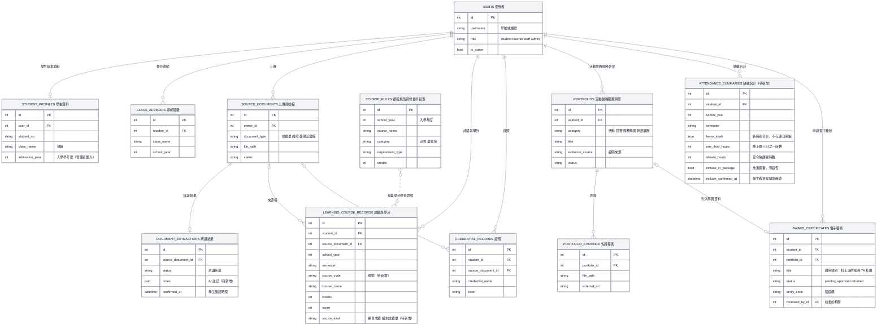
```mermaid
%%{init: {'theme':'base','themeVariables': {'fontFamily':'Arial, Microsoft JhengHei, sans-serif','fontSize':'14px','primaryColor':'#F3F4F6','primaryTextColor':'#111827','primaryBorderColor':'#9CA3AF','lineColor':'#6B7280'},'er':{'minEntityWidth':160,'entityPadding':20}}}%%
erDiagram
    USERS ||--o| STUDENT_PROFILES : "學生基本資料"
    USERS ||--o{ CLASS_ADVISORS : "擔任導師"
    USERS ||--o{ SOURCE_DOCUMENTS : "上傳"
    SOURCE_DOCUMENTS ||--o| DOCUMENT_EXTRACTIONS : "辨識結果"
    USERS ||--o{ LEARNING_COURSE_RECORDS : "成績與學分"
    SOURCE_DOCUMENTS |o--o{ LEARNING_COURSE_RECORDS : "來源檔"
    COURSE_RULES }o..o{ LEARNING_COURSE_RECORDS : "畢業學分檢查對照"
    USERS ||--o{ CREDENTIAL_RECORDS : "證照"
    SOURCE_DOCUMENTS |o--o{ CREDENTIAL_RECORDS : "來源檔"
    USERS ||--o{ PORTFOLIOS : "活動競賽服務幹部"
    PORTFOLIOS ||--o{ PORTFOLIO_EVIDENCE : "佐證"
    USERS ||--o{ ATTENDANCE_SUMMARIES : "缺曠合計"
    USERS ||--o{ AWARD_CERTIFICATES : "申請電子獎狀"
    PORTFOLIOS |o--o| AWARD_CERTIFICATES : "列入學習資料"

    USERS["USERS 使用者　　　"] {
        int id PK
        string username "學號或帳號"
        string role "student teacher staff admin"
        bool is_active
    }
    STUDENT_PROFILES["STUDENT_PROFILES 學生資料　　　"] {
        int id PK
        int user_id FK
        string student_no
        string class_name "班級"
        int admission_year "入學學年度（管理者匯入）"
    }
    CLASS_ADVISORS["CLASS_ADVISORS 導師班級　　　"] {
        int id PK
        int teacher_id FK
        string class_name
        int school_year
    }
    SOURCE_DOCUMENTS["SOURCE_DOCUMENTS 上傳原始檔　　　"] {
        int id PK
        int owner_id FK
        string document_type "成績單 證照 獎懲記錄等"
        string file_path
        string status
    }
    DOCUMENT_EXTRACTIONS["DOCUMENT_EXTRACTIONS 辨識結果　　　"] {
        int id PK
        int source_document_id FK
        string status "辨識狀態"
        json notes "AI 註記（待新增）"
        datetime confirmed_at "學生確認時間"
    }
    LEARNING_COURSE_RECORDS["LEARNING_COURSE_RECORDS 成績與學分　　　"] {
        int id PK
        int student_id FK
        int source_document_id FK
        int school_year
        string semester
        string course_code "課號（待新增）"
        string course_name
        int credits
        int score
        string source_kind "網頁成績 紙本成績單（待新增）"
    }
    COURSE_RULES["COURSE_RULES 課程規則與修業科目表　　　"] {
        int id PK
        int school_year "入學年度"
        string course_name
        string category "必修 選修等"
        string requirement_type
        int credits
    }
    CREDENTIAL_RECORDS["CREDENTIAL_RECORDS 證照　　　"] {
        int id PK
        int student_id FK
        int source_document_id FK
        string credential_name
        string level
    }
    PORTFOLIOS["PORTFOLIOS 活動競賽服務幹部　　　"] {
        int id PK
        int student_id FK
        string category "活動 競賽 服務學習 幹部經歷"
        string title
        string evidence_source "證明來源"
        string status
    }
    PORTFOLIO_EVIDENCE["PORTFOLIO_EVIDENCE 佐證檔案　　　"] {
        int id PK
        int portfolio_id FK
        string file_path
        string external_url
    }
    ATTENDANCE_SUMMARIES["ATTENDANCE_SUMMARIES 缺曠合計（待新增）　　　"] {
        int id PK
        int student_id FK
        int school_year
        string semester
        json leave_totals "各假別合計，不存逐日明細"
        int one_third_hours "應上課三分之一時數"
        int absent_hours "至今缺課總時數"
        bool include_in_package "放進備審，預設否"
        datetime include_confirmed_at "學生看過提醒並確認"
    }
    AWARD_CERTIFICATES["AWARD_CERTIFICATES 電子獎狀　　　"] {
        int id PK
        int student_id FK
        int portfolio_id FK
        string title "證明類別：科上派的服務 TA 社團"
        string status "pending approved returned"
        string verify_code "驗證碼"
        int reviewed_by_id FK "核准的科辦"
    }
```

### 圖 18-2：校系、目標校系、導師確認與自傳

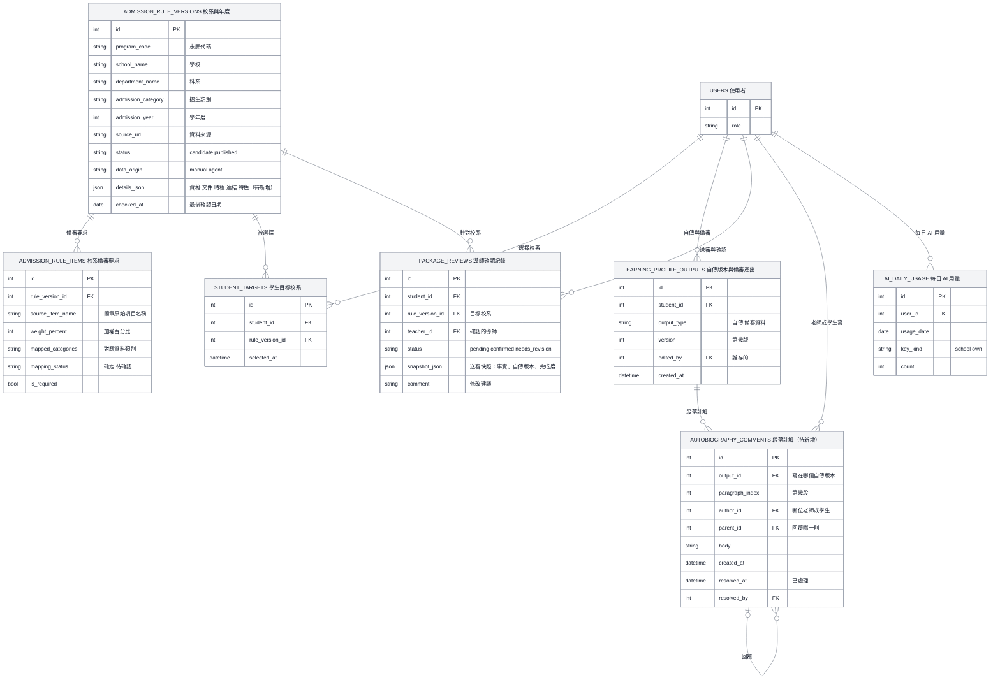
```mermaid
%%{init: {'theme':'base','themeVariables': {'fontFamily':'Arial, Microsoft JhengHei, sans-serif','fontSize':'14px','primaryColor':'#F3F4F6','primaryTextColor':'#111827','primaryBorderColor':'#9CA3AF','lineColor':'#6B7280'},'er':{'minEntityWidth':160,'entityPadding':20}}}%%
erDiagram
    ADMISSION_RULE_VERSIONS ||--o{ ADMISSION_RULE_ITEMS : "備審要求"
    USERS ||--o{ STUDENT_TARGETS : "選擇校系"
    ADMISSION_RULE_VERSIONS ||--o{ STUDENT_TARGETS : "被選擇"
    USERS ||--o{ LEARNING_PROFILE_OUTPUTS : "自傳與備審"
    USERS ||--o{ PACKAGE_REVIEWS : "送審與確認"
    ADMISSION_RULE_VERSIONS ||--o{ PACKAGE_REVIEWS : "針對校系"
    LEARNING_PROFILE_OUTPUTS ||--o{ AUTOBIOGRAPHY_COMMENTS : "段落註解"
    USERS ||--o{ AUTOBIOGRAPHY_COMMENTS : "老師或學生寫"
    AUTOBIOGRAPHY_COMMENTS |o--o{ AUTOBIOGRAPHY_COMMENTS : "回覆"
    USERS ||--o{ AI_DAILY_USAGE : "每日 AI 用量"

    USERS["USERS 使用者　　　"] {
        int id PK
        string role
    }
    ADMISSION_RULE_VERSIONS["ADMISSION_RULE_VERSIONS 校系與年度　　　"] {
        int id PK
        string program_code "志願代碼"
        string school_name "學校"
        string department_name "科系"
        string admission_category "招生類別"
        int admission_year "學年度"
        string source_url "資料來源"
        string status "candidate published"
        string data_origin "manual agent"
        json details_json "資格 文件 時程 連結 特色（待新增）"
        date checked_at "最後確認日期"
    }
    ADMISSION_RULE_ITEMS["ADMISSION_RULE_ITEMS 校系備審要求　　　"] {
        int id PK
        int rule_version_id FK
        string source_item_name "簡章原始項目名稱"
        int weight_percent "加權百分比"
        string mapped_categories "對應資料類別"
        string mapping_status "確定 待確認"
        bool is_required
    }
    STUDENT_TARGETS["STUDENT_TARGETS 學生目標校系　　　"] {
        int id PK
        int student_id FK
        int rule_version_id FK
        datetime selected_at
    }
    LEARNING_PROFILE_OUTPUTS["LEARNING_PROFILE_OUTPUTS 自傳版本與備審產出　　　"] {
        int id PK
        int student_id FK
        string output_type "自傳 備審資料"
        int version "第幾版"
        int edited_by FK "誰存的"
        datetime created_at
    }
    PACKAGE_REVIEWS["PACKAGE_REVIEWS 導師確認紀錄　　　"] {
        int id PK
        int student_id FK
        int rule_version_id FK "目標校系"
        int teacher_id FK "確認的導師"
        string status "pending confirmed needs_revision"
        json snapshot_json "送審快照：事實、自傳版本、完成度"
        string comment "修改建議"
    }
    AUTOBIOGRAPHY_COMMENTS["AUTOBIOGRAPHY_COMMENTS 段落註解（待新增）　　　"] {
        int id PK
        int output_id FK "寫在哪個自傳版本"
        int paragraph_index "第幾段"
        int author_id FK "哪位老師或學生"
        int parent_id FK "回覆哪一則"
        string body
        datetime created_at
        datetime resolved_at "已處理"
        int resolved_by FK
    }
    AI_DAILY_USAGE["AI_DAILY_USAGE 每日 AI 用量　　　"] {
        int id PK
        int user_id FK
        date usage_date
        string key_kind "school own"
        int count
    }
```

### 圖 18-3：資料來源、公告、表單與操作紀錄

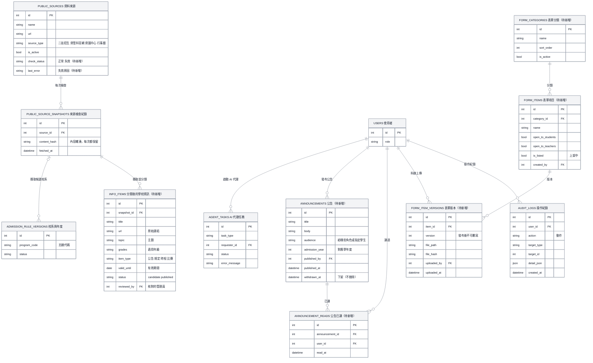
```mermaid
%%{init: {'theme':'base','themeVariables': {'fontFamily':'Arial, Microsoft JhengHei, sans-serif','fontSize':'14px','primaryColor':'#F3F4F6','primaryTextColor':'#111827','primaryBorderColor':'#9CA3AF','lineColor':'#6B7280'},'er':{'minEntityWidth':160,'entityPadding':20}}}%%
erDiagram
    PUBLIC_SOURCES ||--o{ PUBLIC_SOURCE_SNAPSHOTS : "每次檢查"
    PUBLIC_SOURCE_SNAPSHOTS |o--o{ ADMISSION_RULE_VERSIONS : "擷取候選校系"
    PUBLIC_SOURCE_SNAPSHOTS ||--o{ INFO_ITEMS : "擷取並分類"
    USERS ||--o{ AGENT_TASKS : "啟動 AI 代理"
    USERS ||--o{ ANNOUNCEMENTS : "發布公告"
    ANNOUNCEMENTS ||--o{ ANNOUNCEMENT_READS : "已讀"
    USERS ||--o{ ANNOUNCEMENT_READS : "讀過"
    FORM_CATEGORIES ||--o{ FORM_ITEMS : "分類"
    FORM_ITEMS ||--o{ FORM_ITEM_VERSIONS : "版本"
    USERS ||--o{ FORM_ITEM_VERSIONS : "科辦上傳"
    USERS ||--o{ AUDIT_LOGS : "操作紀錄"

    USERS["USERS 使用者　　　"] {
        int id PK
        string role
    }
    PUBLIC_SOURCES["PUBLIC_SOURCES 資料來源　　　"] {
        int id PK
        string name
        string url
        string source_type "二技招生 資管科官網 資圖中心 行事曆"
        bool is_active
        string check_status "正常 失效（待新增）"
        string last_error "失效原因（待新增）"
    }
    PUBLIC_SOURCE_SNAPSHOTS["PUBLIC_SOURCE_SNAPSHOTS 來源檢查紀錄　　　"] {
        int id PK
        int source_id FK
        string content_hash "內容雜湊，每次都保留"
        datetime fetched_at
    }
    ADMISSION_RULE_VERSIONS["ADMISSION_RULE_VERSIONS 校系與年度　　　"] {
        int id PK
        string program_code "志願代碼"
        string status
    }
    AGENT_TASKS["AGENT_TASKS AI 代理任務　　　"] {
        int id PK
        string task_type
        int requester_id FK
        string status
        string error_message
    }
    INFO_ITEMS["INFO_ITEMS 分類後的學校資訊（待新增）　　　"] {
        int id PK
        int snapshot_id FK
        string title
        string url "原始連結"
        string topic "主題"
        string grades "適用年級"
        string item_type "公告 規定 時程 比賽"
        date valid_until "有效期間"
        string status "candidate published"
        int reviewed_by FK "核對的管理員"
    }
    ANNOUNCEMENTS["ANNOUNCEMENTS 公告（待新增）　　　"] {
        int id PK
        string title
        string body
        string audience "給哪些角色或指定學生"
        int admission_year "對應學年度"
        int published_by FK
        datetime published_at
        datetime withdrawn_at "下架（不刪除）"
    }
    ANNOUNCEMENT_READS["ANNOUNCEMENT_READS 公告已讀（待新增）　　　"] {
        int id PK
        int announcement_id FK
        int user_id FK
        datetime read_at
    }
    FORM_CATEGORIES["FORM_CATEGORIES 表單分類（待新增）　　　"] {
        int id PK
        string name
        int sort_order
        bool is_active
    }
    FORM_ITEMS["FORM_ITEMS 表單項目（待新增）　　　"] {
        int id PK
        int category_id FK
        string name
        bool open_to_students
        bool open_to_teachers
        bool is_listed "上架中"
        int created_by FK
    }
    FORM_ITEM_VERSIONS["FORM_ITEM_VERSIONS 表單版本（待新增）　　　"] {
        int id PK
        int item_id FK
        int version "發布後不可覆寫"
        string file_path
        string file_hash
        int uploaded_by FK
        datetime uploaded_at
    }
    AUDIT_LOGS["AUDIT_LOGS 操作紀錄　　　"] {
        int id PK
        int user_id FK
        string action "動作"
        string target_type
        int target_id
        json detail_json
        datetime created_at
    }
```

### 參考：全部資料表總覽


```mermaid
%%{init: {'theme':'base','themeVariables': {'fontFamily':'Arial, Microsoft JhengHei, sans-serif','fontSize':'14px','primaryColor':'#F3F4F6','primaryTextColor':'#111827','primaryBorderColor':'#9CA3AF','lineColor':'#6B7280'},'er':{'minEntityWidth':160,'entityPadding':20}}}%%
erDiagram
    USERS ||--o| STUDENT_PROFILES : "學生基本資料"
    USERS ||--o{ CLASS_ADVISORS : "擔任導師"
    USERS ||--o{ SOURCE_DOCUMENTS : "上傳"
    SOURCE_DOCUMENTS ||--o| DOCUMENT_EXTRACTIONS : "辨識結果"
    USERS ||--o{ LEARNING_COURSE_RECORDS : "成績與學分"
    SOURCE_DOCUMENTS |o--o{ LEARNING_COURSE_RECORDS : "來源檔"
    COURSE_RULES }o..o{ LEARNING_COURSE_RECORDS : "畢業學分檢查對照"
    USERS ||--o{ CREDENTIAL_RECORDS : "證照"
    SOURCE_DOCUMENTS |o--o{ CREDENTIAL_RECORDS : "來源檔"
    USERS ||--o{ PORTFOLIOS : "活動競賽服務幹部"
    PORTFOLIOS ||--o{ PORTFOLIO_EVIDENCE : "佐證"
    USERS ||--o{ ATTENDANCE_SUMMARIES : "缺曠合計"
    USERS ||--o{ AWARD_CERTIFICATES : "申請電子獎狀"
    PORTFOLIOS |o--o| AWARD_CERTIFICATES : "列入學習資料"
    ADMISSION_RULE_VERSIONS ||--o{ ADMISSION_RULE_ITEMS : "備審要求"
    USERS ||--o{ STUDENT_TARGETS : "選擇校系"
    ADMISSION_RULE_VERSIONS ||--o{ STUDENT_TARGETS : "被選擇"
    USERS ||--o{ LEARNING_PROFILE_OUTPUTS : "自傳與備審"
    USERS ||--o{ PACKAGE_REVIEWS : "送審與確認"
    ADMISSION_RULE_VERSIONS ||--o{ PACKAGE_REVIEWS : "針對校系"
    LEARNING_PROFILE_OUTPUTS ||--o{ AUTOBIOGRAPHY_COMMENTS : "段落註解"
    USERS ||--o{ AUTOBIOGRAPHY_COMMENTS : "老師或學生寫"
    AUTOBIOGRAPHY_COMMENTS |o--o{ AUTOBIOGRAPHY_COMMENTS : "回覆"
    USERS ||--o{ AI_DAILY_USAGE : "每日 AI 用量"
    PUBLIC_SOURCES ||--o{ PUBLIC_SOURCE_SNAPSHOTS : "每次檢查"
    PUBLIC_SOURCE_SNAPSHOTS |o--o{ ADMISSION_RULE_VERSIONS : "擷取候選校系"
    PUBLIC_SOURCE_SNAPSHOTS ||--o{ INFO_ITEMS : "擷取並分類"
    USERS ||--o{ AGENT_TASKS : "啟動 AI 代理"
    USERS ||--o{ ANNOUNCEMENTS : "發布公告"
    ANNOUNCEMENTS ||--o{ ANNOUNCEMENT_READS : "已讀"
    USERS ||--o{ ANNOUNCEMENT_READS : "讀過"
    FORM_CATEGORIES ||--o{ FORM_ITEMS : "分類"
    FORM_ITEMS ||--o{ FORM_ITEM_VERSIONS : "版本"
    USERS ||--o{ FORM_ITEM_VERSIONS : "科辦上傳"
    USERS ||--o{ AUDIT_LOGS : "操作紀錄"

    USERS["USERS 使用者　　　"] {
        int id PK
        string username "學號或帳號"
        string role "student teacher staff admin"
        bool is_active
    }
    STUDENT_PROFILES["STUDENT_PROFILES 學生資料　　　"] {
        int id PK
        int user_id FK
        string student_no
        string class_name "班級"
        int admission_year "入學學年度（管理者匯入）"
    }
    CLASS_ADVISORS["CLASS_ADVISORS 導師班級　　　"] {
        int id PK
        int teacher_id FK
        string class_name
        int school_year
    }
    SOURCE_DOCUMENTS["SOURCE_DOCUMENTS 上傳原始檔　　　"] {
        int id PK
        int owner_id FK
        string document_type "成績單 證照 獎懲記錄等"
        string file_path
        string status
    }
    DOCUMENT_EXTRACTIONS["DOCUMENT_EXTRACTIONS 辨識結果　　　"] {
        int id PK
        int source_document_id FK
        string status "辨識狀態"
        json notes "AI 註記（待新增）"
        datetime confirmed_at "學生確認時間"
    }
    LEARNING_COURSE_RECORDS["LEARNING_COURSE_RECORDS 成績與學分　　　"] {
        int id PK
        int student_id FK
        int source_document_id FK
        int school_year
        string semester
        string course_code "課號（待新增）"
        string course_name
        int credits
        int score
        string source_kind "網頁成績 紙本成績單（待新增）"
    }
    CREDENTIAL_RECORDS["CREDENTIAL_RECORDS 證照　　　"] {
        int id PK
        int student_id FK
        int source_document_id FK
        string credential_name
        string level
    }
    PORTFOLIOS["PORTFOLIOS 活動競賽服務幹部　　　"] {
        int id PK
        int student_id FK
        string category "活動 競賽 服務學習 幹部經歷"
        string title
        string evidence_source "證明來源"
        string status
    }
    PORTFOLIO_EVIDENCE["PORTFOLIO_EVIDENCE 佐證檔案　　　"] {
        int id PK
        int portfolio_id FK
        string file_path
        string external_url
    }
    ATTENDANCE_SUMMARIES["ATTENDANCE_SUMMARIES 缺曠合計（待新增）　　　"] {
        int id PK
        int student_id FK
        int school_year
        string semester
        json leave_totals "各假別合計，不存逐日明細"
        int one_third_hours "應上課三分之一時數"
        int absent_hours "至今缺課總時數"
        bool include_in_package "放進備審，預設否"
        datetime include_confirmed_at "學生看過提醒並確認"
    }
    COURSE_RULES["COURSE_RULES 課程規則與修業科目表　　　"] {
        int id PK
        int school_year "入學年度"
        string course_name
        string category "必修 選修等"
        string requirement_type
        int credits
    }
    AWARD_CERTIFICATES["AWARD_CERTIFICATES 電子獎狀　　　"] {
        int id PK
        int student_id FK
        int portfolio_id FK
        string title "證明類別：科上派的服務 TA 社團"
        string status "pending approved returned"
        string verify_code "驗證碼"
        int reviewed_by_id FK "核准的科辦"
    }
    ADMISSION_RULE_VERSIONS["ADMISSION_RULE_VERSIONS 校系與年度　　　"] {
        int id PK
        string program_code "志願代碼"
        string school_name "學校"
        string department_name "科系"
        string admission_category "招生類別"
        int admission_year "學年度"
        string source_url "資料來源"
        string status "candidate published"
        string data_origin "manual agent"
        json details_json "資格 文件 時程 連結 特色（待新增）"
        date checked_at "最後確認日期"
    }
    ADMISSION_RULE_ITEMS["ADMISSION_RULE_ITEMS 校系備審要求　　　"] {
        int id PK
        int rule_version_id FK
        string source_item_name "簡章原始項目名稱"
        int weight_percent "加權百分比"
        string mapped_categories "對應資料類別"
        string mapping_status "確定 待確認"
        bool is_required
    }
    STUDENT_TARGETS["STUDENT_TARGETS 學生目標校系　　　"] {
        int id PK
        int student_id FK
        int rule_version_id FK
        datetime selected_at
    }
    LEARNING_PROFILE_OUTPUTS["LEARNING_PROFILE_OUTPUTS 自傳版本與備審產出　　　"] {
        int id PK
        int student_id FK
        string output_type "自傳 備審資料"
        int version "第幾版"
        int edited_by FK "誰存的"
        datetime created_at
    }
    PACKAGE_REVIEWS["PACKAGE_REVIEWS 導師確認紀錄　　　"] {
        int id PK
        int student_id FK
        int rule_version_id FK "目標校系"
        int teacher_id FK "確認的導師"
        string status "pending confirmed needs_revision"
        json snapshot_json "送審快照：事實、自傳版本、完成度"
        string comment "修改建議"
    }
    AUTOBIOGRAPHY_COMMENTS["AUTOBIOGRAPHY_COMMENTS 段落註解（待新增）　　　"] {
        int id PK
        int output_id FK "寫在哪個自傳版本"
        int paragraph_index "第幾段"
        int author_id FK "哪位老師或學生"
        int parent_id FK "回覆哪一則"
        string body
        datetime created_at
        datetime resolved_at "已處理"
        int resolved_by FK
    }
    AI_DAILY_USAGE["AI_DAILY_USAGE 每日 AI 用量　　　"] {
        int id PK
        int user_id FK
        date usage_date
        string key_kind "school own"
        int count
    }
    PUBLIC_SOURCES["PUBLIC_SOURCES 資料來源　　　"] {
        int id PK
        string name
        string url
        string source_type "二技招生 資管科官網 資圖中心 行事曆"
        bool is_active
        string check_status "正常 失效（待新增）"
        string last_error "失效原因（待新增）"
    }
    PUBLIC_SOURCE_SNAPSHOTS["PUBLIC_SOURCE_SNAPSHOTS 來源檢查紀錄　　　"] {
        int id PK
        int source_id FK
        string content_hash "內容雜湊，每次都保留"
        datetime fetched_at
    }
    AGENT_TASKS["AGENT_TASKS AI 代理任務　　　"] {
        int id PK
        string task_type
        int requester_id FK
        string status
        string error_message
    }
    INFO_ITEMS["INFO_ITEMS 分類後的學校資訊（待新增）　　　"] {
        int id PK
        int snapshot_id FK
        string title
        string url "原始連結"
        string topic "主題"
        string grades "適用年級"
        string item_type "公告 規定 時程 比賽"
        date valid_until "有效期間"
        string status "candidate published"
        int reviewed_by FK "核對的管理員"
    }
    ANNOUNCEMENTS["ANNOUNCEMENTS 公告（待新增）　　　"] {
        int id PK
        string title
        string body
        string audience "給哪些角色或指定學生"
        int admission_year "對應學年度"
        int published_by FK
        datetime published_at
        datetime withdrawn_at "下架（不刪除）"
    }
    ANNOUNCEMENT_READS["ANNOUNCEMENT_READS 公告已讀（待新增）　　　"] {
        int id PK
        int announcement_id FK
        int user_id FK
        datetime read_at
    }
    FORM_CATEGORIES["FORM_CATEGORIES 表單分類（待新增）　　　"] {
        int id PK
        string name
        int sort_order
        bool is_active
    }
    FORM_ITEMS["FORM_ITEMS 表單項目（待新增）　　　"] {
        int id PK
        int category_id FK
        string name
        bool open_to_students
        bool open_to_teachers
        bool is_listed "上架中"
        int created_by FK
    }
    FORM_ITEM_VERSIONS["FORM_ITEM_VERSIONS 表單版本（待新增）　　　"] {
        int id PK
        int item_id FK
        int version "發布後不可覆寫"
        string file_path
        string file_hash
        int uploaded_by FK
        datetime uploaded_at
    }
    AUDIT_LOGS["AUDIT_LOGS 操作紀錄　　　"] {
        int id PK
        int user_id FK
        string action "動作"
        string target_type
        int target_id
        json detail_json
        datetime created_at
    }
```

## 圖 19：報告用總體流程圖


```mermaid
%%{init: {'theme':'base','themeVariables': {'fontFamily':'Microsoft JhengHei, Noto Sans TC, Arial, sans-serif','primaryColor':'#F3F4F6','primaryTextColor':'#111827','primaryBorderColor':'#9CA3AF','lineColor':'#6B7280','edgeLabelBackground':'#FFFFFF'},'flowchart':{'wrappingWidth':400}}}%%
flowchart LR
    classDef student fill:#DBEAFE,stroke:#9CA3AF,color:#111827,stroke-width:1px;
    classDef system fill:#F3F4F6,stroke:#9CA3AF,color:#111827,stroke-width:1px;
    classDef teacher fill:#DCFCE7,stroke:#9CA3AF,color:#111827,stroke-width:1px;
    classDef staff fill:#EDE9FE,stroke:#9CA3AF,color:#111827,stroke-width:1px;
    classDef ai fill:#FFEDD5,stroke:#9CA3AF,color:#111827,stroke-width:1px;

    Notice[二技公告<br/>管理員核對後發布]:::system --> Recommend
    Recommend[AI 推薦校系]:::ai --> Target[學生選擇目標校系]:::student
    Target --> Upload[上傳六類資料<br/>成績、獎懲、缺曠可貼上匯入]:::student
    Upload --> Check[AI 辨識並註記修改建議<br/>證照初判]:::ai
    Check --> Confirm[學生確認並補齊資料]:::student
    Confirm -.科上派的服務.-> Staff[科辦核准<br/>電子獎狀]:::staff
    Staff -.-> Core
    Confirm --> Core[系統比對缺件]:::system
    Core --> Teacher
    Teacher[導師確認送審版本<br/>老師可加段落註解]:::teacher
    Teacher --> Output[產出完整備審資料]:::system
```

## 修改圖表的步驟

1. 修改 `docs/images/` 裡對應的 `.mmd` 檔。
2. 匯出圖片（需先安裝 Mermaid CLI）：

   ```bash
   mmdc -i D-10-main-line-flow.mmd -o D-10-main-line-flow.png -b white -s 2
   mmdc -i D-10-main-line-flow.mmd -o D-10-main-line-flow.svg -b white
   ```

3. 重新產生本文件，或把 `.mmd` 內容貼回對應章節，確保兩邊一致。
4. 使用案例圖（圖 1～4）改 `D-01-use-case-by-role.py`；ERD（圖 18）改 `D-09-erd-build.py`，執行後再匯出 PNG／SVG。
5. 圖號改了要一起改：規格書、本文件的圖表清單、各圖裡「見圖 N」的文字、`scripts/build_diagram_deck.py`。
